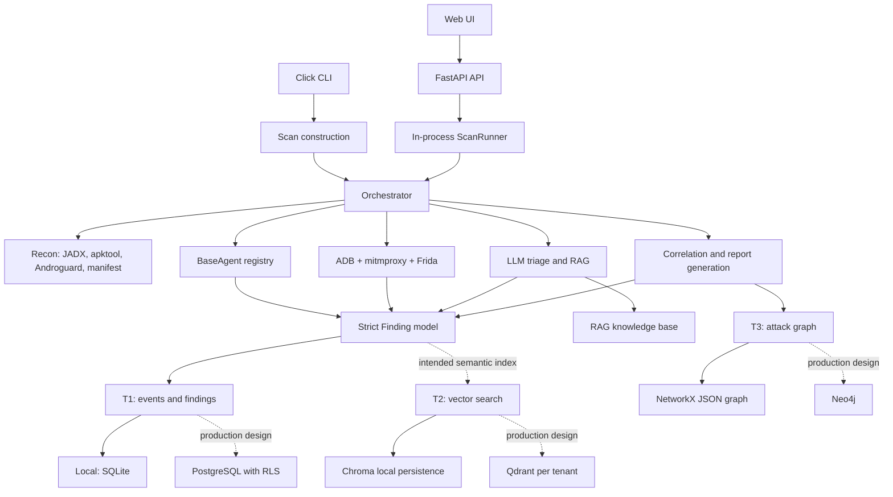
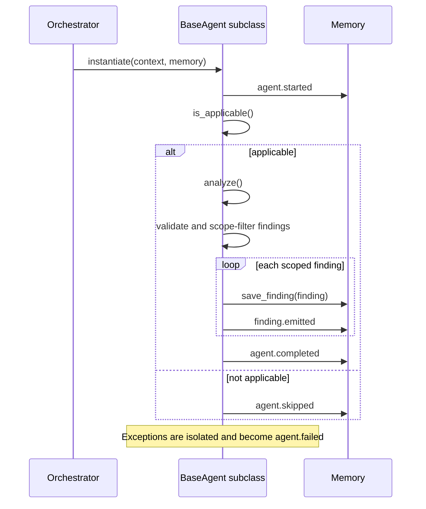
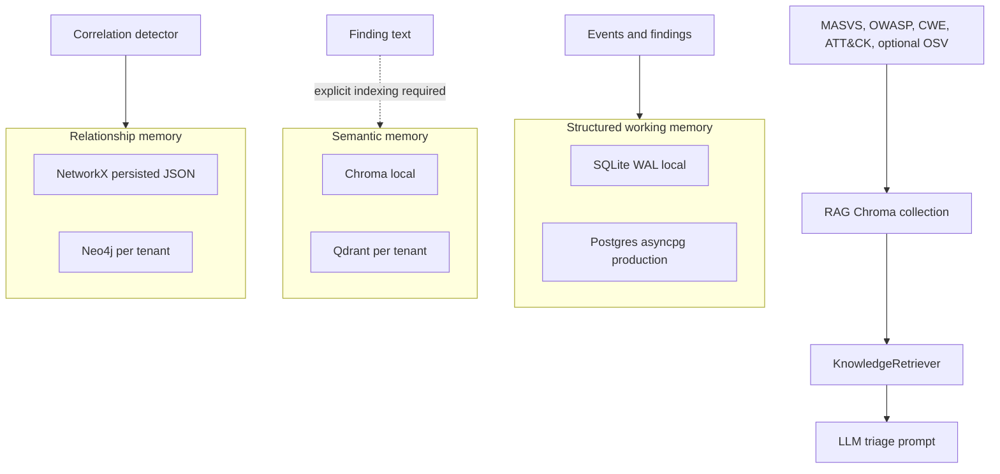
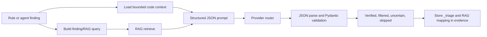

# SENTINEL: Current Implementation Knowledge Map and Critical Assessment

**Scope:** this document describes the current implementation in this checkout.
It distinguishes implemented behavior from intended architecture. It is not a
claim that every named agent or runtime technique has been proven against a
real target device.

**Last refreshed:** 2026-07-13 from the local checkout.

**Source snapshot:** 391 Python files under `sentinel/`, 242 Python files under
`sentinel/agents/`, 13 Python files under `sentinel/exploit/`, 173 Python test
files, 39 frontend JavaScript files, 79 Frida TypeScript files, 18 Semgrep
rules, and 2 top-level YAML rules.

## 1. Executive Summary (Current Maturity)

SENTINEL is an Android-first mobile application security platform. It accepts
an APK-family artifact, reconstructs code and resources, runs a large registry
of static and runtime agents, optionally enriches and triages findings with an
LLM, correlates attack chains, generates reports, and can produce PoC artifacts.
The current API-visible registry contains 200 IDs, but one of them is the
abstract `D_000` base DAST class; the concrete `sentinel.agents.*` inventory is
199 agent classes.

The core static-analysis platform is substantial: parallel recon, a normalized
`Finding` model, broad agent coverage, source/manifest/bytecode evidence, and
best-effort failure isolation. Dynamic analysis is architecturally capable of
ADB, mitmproxy, Frida, hybrid static-to-runtime dispatch, screenshots, API
replay, and fuzzing, but it remains environment-dependent and must be assessed
from tool-health evidence, not the final scan status alone.

The scanner now has a strict proof gate. Findings remain candidates unless
earlier phases provide scope, reachability, evidence, runtime verification,
PoC/replay material, impact proof, and same-scan uniqueness. This prevents a
static pattern match from being presented as a proven bounty issue.

**Current maturity:** advanced prototype and lab-grade mobile-security
platform; not yet a production-ready multi-tenant autonomous VAPT service.
The project is capable enough for controlled, authorized assessment and
internal research. It is not yet safe to treat as a continuously reliable
autonomous exploitation system or a hardened SaaS service.

The production hardening story is partly designed but not consistently active.
The scan CLI and API currently instantiate the local SQLite/Chroma/NetworkX
memory backend. Persistent identity, production tenant isolation, the full
Postgres/Qdrant/Neo4j composition, universal prompt-injection controls, and
active exploitation authorization need further work before a multi-tenant SaaS
deployment is defensible.

**What `completed` means:** the orchestration reached its terminal path without
an `OrchestratorError`. It does not mean every requested tool succeeded, every
agent ran, traffic was attributable to the target, Frida attached, runtime
behavior was confirmed, reports were generated, or exploitation was safe.
Dynamic, triage, correlation, exploitation, and report failures can be reduced
to warnings while the result remains `completed`.

## 2. Architecture Reality Map (Implemented vs Designed)

### Product goal

SENTINEL is designed to turn an Android APK into evidence-backed security
findings suitable for internal AppSec review or authorized bug bounty work. It
combines deterministic detection with optional LLM judgement and runtime
confirmation. The intended trust model is:

1. Static tools produce candidates and evidence.
2. Runtime tools confirm behavior where a device, app state, and hooks permit.
3. The LLM explains and prioritizes evidence; it must not be treated as proof.
4. Reporting presents the distinction between code-only, runtime-verified,
   runtime-failed, auth-gated, and LLM-triaged findings.

### Layered component map



### Actual orchestration order

The README's nominal ten phases are useful as a product taxonomy, but the
implemented driver has a different order and includes sub-phases:

```mermaid
flowchart LR
    P0[0 Ingest] --> P05[0.5 Learning profile]
    P05 --> P1[1 Parallel recon]
    P1 --> P15[1.5 Profiling and AST cache]
    P15 --> P4[4 Dynamic capture, if selected]
    P4 --> P2[2 Concurrent agents]
    P2 --> P26[2.5 Dedup and 2.6 enrichment]
    P26 --> P46[4.6 Frida RPC dispatch, if selected]
    P46 --> P47[4.7 Fuzzing, if selected]
    P47 --> P3[3 LLM triage, if enabled]
    P3 --> P7[7 Correlation]
    P7 --> P75[7.5 Exploitation and PoC]
    P75 --> P76[7.6 Proof gate]
    P76 --> P8[8 Reports]
```



There is no universal, standalone Phase 5 verification loop in the primary
orchestrator, Phase 6 is effectively represented by triage/dedup work, and
Phase 9 meta-exploration is not driven as a terminal scan phase. Verification
classes and meta agents exist, but the main pipeline does not execute them as
one mandatory lifecycle stage.

### Reality table

| Design claim | Current implementation reality | Assessment |
|---|---|---|
| 10-phase autonomous pipeline | Phases 0, 1, 1.5, 2, 3, 4, 4.6, 4.7, 7, 7.5, 7.6, and 8 are partially driven; no mandatory Phase 5 or 9 | Product terminology exceeds lifecycle enforcement |
| Three-tier production memory | Adapters and migrations exist, but CLI/API scans use `LightweightMemory` | Designed, not the default deployed path |
| Tenant-scoped scan workspace | Upload path is tenant-scoped, scan workspace is globally session-scoped | Isolation claim is broken in active scan path |
| Persistent SaaS state | Scan jobs, users, API keys, and default revocation are process-local | Single-process prototype behavior |
| Runtime confirmation | Device/proxy/Frida flows exist and return health data | Evidence is conditional; `completed` does not prove runtime coverage |
| Autonomous exploitation safety | Standalone generator is scope-gated; orchestrated driver has inconsistent authorization | Dangerous dual-use boundary |

### Data flow

1. **Ingest:** hash the APK, record size, create the session workspace.
2. **Recon:** run JADX, apktool, Androguard, and manifest parsing concurrently.
   Partial success is retained in `ScanContext.sources`.
3. **Dynamic, if enabled:** obtain a device, optionally install the app, set a
   device proxy, capture traffic, optionally attach Frida, then clean up.
4. **Agents:** create one instance per enabled agent and run them concurrently.
5. **Finding lifecycle:** validate -> scope-filter -> persist -> emit events ->
   deduplicate/enrich -> optional triage -> optional correlation/exploitation
   -> proof-gate classification.
6. **Reporting:** render markdown, HTML, JSON, compliance and evidence views.

The orchestrator deliberately degrades many phase errors to warnings. This
maximizes static coverage when tooling fails, but a result marked `completed`
can have no device, no proxy capture, no Frida attach, failed report generation,
or no LLM triage. Consumers must inspect `warnings` and `tool_health`.

## 3. Agent System Analysis

### BaseAgent contract

Every detection agent derives from `BaseAgent` and defines an `AGENT_ID`,
`VULN_CLASS`, `is_applicable()`, and `analyze()` implementation.



`BaseAgent` automatically injects session and agent IDs. It also fills
`evidence.package` from manifest data when missing, closing a common scope
filter bypass. Scope checks use package and host evidence. An unrestricted
scope permits all findings; an incomplete evidence object can still weaken
scope precision for host-only or non-package findings.

### Registry and execution model

The `/agents` endpoint imports `sentinel.agents.*`, walks the recursive
`BaseAgent.__subclasses__()` tree, and builds a live catalog at API import
time. The API scan runner starts from a curated SAST ordering, appends
discovered non-dynamic agents, and then adds mitmproxy-backed agents only when
dynamic mode is enabled. Frida observers and hybrid SAST-to-DAST targets need
both dynamic and Frida mode. Duplicate IDs are rejected by the orchestrator
roster.

Refresh checks from this checkout:

- `/agents` runtime registry: **200 IDs**.
- Concrete `sentinel.agents.*` classes with `AGENT_ID`: **199**.
- API roster sizes from `_build_full_roster()`: **114** static, **122**
  dynamic without Frida, **200** dynamic with Frida.
- `D_000` is included in the runtime registry, but it is the abstract
  `BaseDASTAgent`, not a runnable detection agent. Phase 2 catches the
  construction failure and continues, so the defect degrades coverage/counting
  rather than failing the whole scan.
- The CLI scan path still constructs a separate hand-curated roster in
  `sentinel/cli.py`, so CLI coverage can lag the API runner.
- The frontend Agents page prefers live `/agents` data and merges it with
  `frontend/js/data/agents.js`; that static fallback is not authoritative.

Agent count is not a coverage guarantee. An imported agent can be inapplicable,
fail locally, be skipped by a profile, require runtime state, or lack the
source/runtime data it needs.

### Agent implementation modes

The current agent roster is mostly deterministic. As mutually exclusive
implementation buckets, the source-backed classification is:

| Mode | Count | Which agents |
|---|---:|---|
| Rule-only or deterministic implementation | **187** | Every concrete agent in the full inventory except the ten hybrid agents and the two LLM-assisted support agents listed below. This includes regex/source scanners, Semgrep/YAML rules, manifest checks, taint analysis, API replayers, Frida/runtime observers, correlation, and most dynamic verifiers. |
| Hybrid rule + LLM vulnerability decision | **10** | `API_002`, `A_002`, `A_015`, `C_001`, `C_002`, `LOG_001`, `N_016`, `N_017`, `P_001`, `WV_001`. |
| Pure LLM-only vulnerability discovery | **0** | No concrete `sentinel.agents.*` detector relies only on an LLM to find vulnerabilities. |
| LLM-assisted support, not LLM vulnerability discovery | **2** | `D_090` can use an LLM-shaped severity rationale after runtime verification; `R_001` can use the router for report narrative enrichment. Their vulnerability/report inclusion decisions remain deterministic. |
| Non-runnable registry defect | **1** | `D_000` is `BaseDASTAgent`, an abstract base class that should not appear as a runnable detector. |

If you count by vulnerability decision rather than by implementation bucket,
**189 concrete agents make deterministic/rule-based vulnerability or report
inclusion decisions**: the 187 rule-only agents plus `D_090` and `R_001`.
Those two are separated above only because they can call an LLM for wording,
not because an LLM discovers their vulnerabilities.

The hybrid agents are all subclasses of `AIAutonomousAgent`. Their flow is not
pure AI: `fast_pre_filter()` first produces candidates using deterministic
rules, then `LLMVulnerabilityAnalyzer` decides whether each candidate is true
positive, uncertain, needs DAST validation, or false positive.

| Hybrid ID | Class | What is rule-based | What is LLM-based |
|---|---|---|---|
| `API_002` | `API002BOLAIDORAgent` | Candidate BOLA/IDOR endpoint and object-reference signals | Verdict, confidence, exploit-path/impact wording |
| `A_002` | `A002AIJWTAlgConfusionAgent` | JWT algorithm-confusion code/signature candidates | Verdict and severity rationale |
| `A_015` | `A001AIHardcodedCredsAgent` | Hardcoded credential/secret candidate extraction | True/false-positive decision and impact |
| `C_001` | `C001ECBModeAgent` | AES/ECB pattern candidates | Verdict and remediation/exploitability explanation |
| `C_002` | `C002StaticIVAgent` | Static/predictable IV pattern candidates | Verdict and impact explanation |
| `LOG_001` | `LOG001PIILogsAgent` | Logcat/PII logging candidate extraction | Verdict and data-impact judgement |
| `N_016` | `N001CleartextHTTPAgent` | Cleartext HTTP endpoint candidates | Verdict and exploitability/impact explanation |
| `N_017` | `N002MissingPinningAgent` | Missing pinning/network trust candidates | Verdict and DAST-validation guidance |
| `P_001` | `P001DeepLinkHijackAgent` | Exported deep-link handler candidates | Verdict and attack-path explanation |
| `WV_001` | `WV001JSBridgeAgent` | WebView JavaScript bridge candidates | Verdict and exploitability explanation |

So the practical answer is: **rule-only agents are all remaining concrete agent
IDs in the inventory after removing the ten hybrid IDs plus `D_090` and
`R_001`; LLM-only vulnerability agents are none; both rule-based and LLM-based
vulnerability agents are the ten `AIAutonomousAgent` subclasses above.** LLM
triage, RAG, report enrichment, exploit artifact generation, and swarm
workflows are separate pipeline components and must not be counted as pure LLM
vulnerability-finding agents.

#### How rule-based agents find vulnerabilities

Rule-based agents find vulnerabilities by applying deterministic checks to
artifacts already collected in `ScanContext`. The common lifecycle is:

1. `BaseAgent.run()` starts the agent, checks `is_applicable()`, and calls
   `analyze()` only when the required evidence exists.
2. The agent reads one or more local evidence sources: parsed manifest,
   decompiled Java/Kotlin, resources, native symbols, Semgrep JSON, mitmproxy
   traffic, ADB output, Frida observations, screenshots, API schemas, or
   previously stored findings.
3. The agent applies fixed logic: regex patterns, entropy thresholds, AST or
   Semgrep YAML rules, manifest attribute checks, simple control/data-flow,
   taint sources and sinks, endpoint replay, ID mutation, runtime event
   matching, or hard-coded correlation patterns.
4. The agent computes confidence and severity from the matched rule, source,
   sink, exploit prerequisite, and observed runtime impact. For example,
   `A_001` uses secret regexes plus entropy and sink checks; `SG_001` maps
   Semgrep rule metadata into findings; dynamic agents use ADB/Frida/traffic
   results to decide whether a behavior actually happened.
5. The agent emits `Finding` objects with file, line, package, host, request,
   response, screenshot, or runtime evidence. `BaseAgent` then scope-filters
   the finding and stores only in-scope results.

Rule-based agents are fast, repeatable, and auditable because the same input
produces the same decision. Their weakness is context: a broad regex or manifest
rule can over-report unless runtime verification, source review, or the proof
gate confirms reachability and impact.

#### How LLM-based and hybrid agents find vulnerabilities

There are no pure LLM-only vulnerability discovery agents in this checkout.
The LLM-based vulnerability agents are hybrid agents built on
`AIAutonomousAgent`, and they find vulnerabilities in two stages:

1. The deterministic `fast_pre_filter()` stage scans code or manifest data and
   creates `Candidate` objects. Each candidate includes a code snippet, file,
   line, column, triggering rule ID, rule confidence, and surrounding context.
   This stage is intentionally high recall, so it can include placeholders,
   examples, mitigated code, or candidates that need runtime proof.
2. `AIAutonomousAgent.analyze()` caps candidates at `MAX_CANDIDATES = 50`,
   keeps the highest-confidence candidates, and sends each one to
   `LLMVulnerabilityAnalyzer.analyze_candidate()`.
3. `LLMVulnerabilityAnalyzer` retrieves optional RAG context, builds a
   JSON-only prompt containing the candidate code, bounded file context,
   triggering rule, rule confidence, app category, and standards context, then
   calls the provider router with `query_json()`.
4. The LLM must return a typed verdict: `true_positive`, `false_positive`,
   `uncertain`, or `needs_dast_validation`. The analyzer parses that response
   into an `LLMVerdict`, clamps severity/confidence fields, and calibrates
   disagreements between rule confidence and LLM confidence.
5. Verdict routing is deterministic after the LLM response:
   `true_positive` becomes a finding; `needs_dast_validation` becomes a finding
   marked `NEEDS_VERIFICATION`; `uncertain` becomes an informational finding;
   `false_positive` is suppressed and logged as calibration data.
6. Hybrid findings store both sides of the decision in evidence:
   `rule_triggered`, `rule_confidence`, `llm_confidence`, `llm_provider`,
   exploit path, business impact, similar CVEs, and any requested DAST
   validation.

In practical terms, the rule stage answers "where is a suspicious candidate?"
and the LLM stage answers "does this candidate look like a real vulnerability,
what is the likely exploit path, and what validation is still needed?" The LLM
does not install the app, bypass auth, capture runtime traffic, or prove impact
by itself. A bounty-grade result still needs the proof gate: reachable target,
in-scope asset, reproducible PoC, runtime or source-backed evidence,
exploitability/impact, and duplicate/known-issue checks.

### Full API-visible agent inventory

This table lists every ID the current `sentinel.agents.*` registry exposes.
`D_000` is intentionally marked as a defect because it is an abstract base
class that should not appear in a runnable roster.

| ID | Family | Class | Purpose |
|---|---|---|---|
| `API_001` | API Security | `OpenAPIInferrerAgent` | Mobile Backend API Security |
| `API_002` | API Security | `API002BOLAIDORAgent` | Broken Object Level Authorization (BOLA/IDOR) |
| `API_003` | API Security | `MassAssignmentFuzzerAgent` | Mass Assignment |
| `API_004` | API Security | `DataExposureAgent` | Excessive Data Exposure |
| `API_005` | API Security | `BOLAVerifierAgent` | Broken Object Level Authorization |
| `A_001` | Authentication | `A001HardcodedCredsAgent` | Hardcoded Credentials |
| `A_002` | Authentication | `A002AIJWTAlgConfusionAgent` | JWT Algorithm Confusion |
| `A_004` | Authentication | `HardcodedSecretsAgent` | Hardcoded Secret |
| `A_008` | Authentication | `BiometricBypassAgent` | Biometric Authentication Bypass |
| `A_009` | Authentication | `TapJackingAgent` | Tap-Jacking Exposure |
| `A_010` | Authentication | `SessionTokenInUrlAgent` | Session Token in URL |
| `A_011` | Authentication | `RefreshTokenReuseAgent` | Refresh Token Survives Logout |
| `A_012` | Authentication | `SessionFixationAgent` | Session Fixation |
| `A_013` | Authentication | `MagicLinkTokenAgent` | Magic Link Token Replay |
| `A_014` | Authentication | `InsecureAuthStorageAgent` | Insecure Auth Token Storage |
| `A_015` | Authentication | `A001AIHardcodedCredsAgent` | Hardcoded Credentials |
| `A_016` | Authentication | `A002JWTAlgConfusionAgent` | JWT Algorithm Confusion |
| `BAK_001` | Backup | `InsecureBackupAgent` | Insecure Backup |
| `B_001` | Business Logic | `RestIdorAgent` | REST API IDOR |
| `B_003` | Business Logic | `RaceConditionAgent` | Race Condition / TOCTOU |
| `B_004` | Business Logic | `IapBypassAgent` | In-App Purchase Bypass |
| `B_005` | Business Logic | `OAuthRedirectUriAgent` | OAuth redirect_uri Hijack |
| `B_006` | Business Logic | `UnsignedUpdateAgent` | Unsigned APK Install |
| `B_007` | Business Logic | `ClientSideAuthzAgent` | Client-Side Authorization Gate |
| `B_008` | Business Logic | `ClientSideTrustAgent` | Client-Side Trust Violation |
| `COR_001` | Correlation | `ExploitChainAgent` | Exploit Chain |
| `C_001` | Crypto/Storage | `C001ECBModeAgent` | Insecure Cipher Mode - AES/ECB |
| `C_002` | Crypto/Storage | `C002StaticIVAgent` | Static or Predictable IV |
| `C_005` | Crypto/Storage | `HardcodedCryptoKeysAgent` | Hardcoded Cryptographic Keys |
| `C_006` | Crypto/Storage | `EcbModeAgent` | ECB Cipher Mode |
| `C_007` | Crypto/Storage | `WeakCryptoAgent` | Weak Cryptography |
| `C_010` | Crypto/Storage | `SQLCipherKeyDerivationAgent` | Insecure SQLCipher Key Derivation |
| `C_011` | Crypto/Storage | `KeystoreMisuseAgent` | Android Keystore Misuse |
| `C_012` | Crypto/Storage | `AesGcmNonceReuseAgent` | AES-GCM Nonce Reuse |
| `C_013` | Crypto/Storage | `JavaSerializationAgent` | Java Native Deserialization |
| `C_014` | Crypto/Storage | `CbcPredictableIvAgent` | AES-CBC Predictable IV |
| `C_015` | Crypto/Storage | `WeakPrngSeedAgent` | Weak PRNG Seed |
| `C_016` | Crypto/Storage | `HashKdfAgent` | Hash Used as Key Derivation Function |
| `C_017` | Crypto/Storage | `HardcodedCertFinderAgent` | Hardcoded Certificate/Key |
| `C_018` | Crypto/Storage | `CryptoConstantsAgent` | Roll-Your-Own Crypto |
| `C_019` | Crypto/Storage | `MissingKeyAttestationAgent` | Missing Key Attestation Challenge |
| `DAST_001` | DAST base Frida | `D001AntiFridaAgent` | Anti-Tampering Detection |
| `DAST_002` | DAST base Frida | `D002SSLBypassAgent` | SSL Pinning Bypass |
| `DAST_003` | DAST base Frida | `D003RuntimeCryptoAgent` | Runtime Crypto Weakness |
| `DAST_004` | DAST base Frida | `D004RuntimeTaintAgent` | Runtime Taint Flow |
| `D_000` | DAST base Frida | `BaseDASTAgent` | Abstract base class, not runnable |
| `D_001` | Dynamic | `ClipboardLeakAgent` | Clipboard Sensitive Data Leak |
| `D_002` | Dynamic | `FlagSecureMissingAgent` | Missing FLAG_SECURE on Sensitive Screen |
| `D_003` | Dynamic | `BiometricWeakAgent` | Insecure Biometric Prompt |
| `D_004` | Dynamic | `AntiTamperCoverageAgent` | Missing Anti-Tamper Coverage |
| `D_005` | Dynamic | `DynamicCodeLoadingAgent` | Dynamic Code Loading |
| `D_006` | Dynamic | `StaticIvReuseAgent` | Runtime IV / Key Reuse |
| `D_007` | Dynamic | `RaceConditionCandidateAgent` | Race-Condition / TOCTOU Candidate |
| `D_008` | Dynamic | `IapBypassAgent` | In-App Purchase Verification Bypass |
| `D_009` | Dynamic | `IdorCandidateAgent` | IDOR / Mass-Assignment Candidate |
| `D_010` | Dynamic | `JwtWeaknessAgent` | JWT Weakness |
| `D_011` | Dynamic | `WebViewRuntimeAgent` | Insecure WebView Runtime Configuration |
| `D_012` | Dynamic | `NotificationLeakAgent` | Sensitive Lockscreen Notification |
| `D_013` | Dynamic | `ThirdPartyPiiLeakAgent` | Sensitive Data Sent to Third-Party Endpoint |
| `D_014` | Dynamic | `CookieHardeningAgent` | Cookie Hardening Weakness |
| `D_015` | Dynamic | `ImplicitIntentLeakAgent` | Implicit Intent Sensitive Extras Leak |
| `D_016` | Dynamic | `AccessibilityAbuseAgent` | Accessibility / NotificationListener Abuse Pattern |
| `D_017` | Dynamic | `GraphqlPersistedQueryAgent` | GraphQL Persisted-Query Bypass |
| `D_018` | Dynamic | `SmsPermissionAbuseAgent` | SMS Permission / Retriever-API Abuse |
| `D_019` | Dynamic | `ScreenCaptureAgent` | Screen Capture / MediaProjection Pipeline |
| `D_020` | Dynamic | `DynamicReceiverExportAgent` | Dynamically-Registered Receiver Implicit Export |
| `D_021` | Dynamic | `PendingIntentMutableAgent` | PendingIntent Mutable at Runtime |
| `D_022` | Dynamic | `LocalSocketServerAgent` | Local-Socket Server Exposed Across App Boundary |
| `D_023` | Dynamic | `ContentProviderUriExposureAgent` | ContentProvider URI Exposure to Cross-UID Caller |
| `D_024` | Dynamic | `FileProviderTraversalAgent` | FileProvider Path-Traversal / Symlink Escape |
| `D_025` | Dynamic | `BackgroundLocationLeakAgent` | Background Location Request |
| `D_026` | Dynamic | `InsecureKeystoreUsageAgent` | Insecure Android-Keystore Key Generation |
| `D_027` | Dynamic | `ZipPathTraversalAgent` | Zip-Slip / Archive Path Traversal |
| `D_028` | Dynamic | `InsecureRandomRuntimeAgent` | Insecure RNG in Security Context |
| `D_029` | Dynamic | `InsecureHostnameVerifierAgent` | Custom HostnameVerifier Accepts Mismatched Cert |
| `D_030` | Dynamic | `InAppUpdateInsecureAgent` | In-App Update Installs Unverified APK |
| `D_031` | Dynamic | `UnsafeJsonDeserializationAgent` | Unsafe JSON Deserialization |
| `D_032` | Dynamic | `SqliteCommandInjectionAgent` | SQLite Command Injection / Unparameterised Query |
| `D_033` | Dynamic | `UnsafeReflectionInvokeAgent` | Unsafe Reflection Invocation Chain |
| `D_034` | Dynamic | `ExportedActivityResultLeakAgent` | Exported Activity Returns Sensitive Data Cross-App |
| `D_035` | Dynamic | `LocalFileLogLeakAgent` | Sensitive Data Emitted to Log / Local File |
| `D_036` | Dynamic | `ClipboardListenerSnoopAgent` | Background Clipboard Read |
| `D_037` | Dynamic | `BroadcastWiretapAgent` | Receiver Wiretaps Sensitive System Broadcasts |
| `D_038` | Dynamic | `InsecureTrustManagerRuntimeAgent` | Custom X509TrustManager Accepts Invalid Chain |
| `D_039` | Dynamic | `OkHttpLoggingRuntimeAgent` | OkHttp HttpLoggingInterceptor Logs Body / Headers |
| `D_040` | Dynamic | `BiometricDeviceCredentialFallbackAgent` | Biometric Crypto Bypassable via PIN Fallback |
| `D_041` | Dynamic | `NotificationFloodAgent` | Notification / Toast Flood |
| `D_042` | Dynamic | `DeepLinkBombAgent` | Deep-Link Crash / Bypass Fuzz (Dynamic Testing Target) |
| `D_043` | Dynamic | `HiddenApiHunterAgent` | Hidden Internal Endpoint (Dynamic Testing Target) |
| `D_044` | Dynamic | `BiometricReplayAgent` | Biometric Callback Replay (Dynamic Testing Target) |
| `D_045` | Dynamic | `SqliteProberAgent` | Local SQLite SQLi (Dynamic Testing Target) |
| `D_046` | Dynamic | `RaceConditionTargetAgent` | Race-Condition Candidate (Dynamic Testing Target) |
| `D_047` | Dynamic | `MemoryDumpTargetAgent` | Heap Snapshot Target (Dynamic Testing Target) |
| `D_048` | Dynamic | `WebViewXssAgent` | WebView XSS Injection (Dynamic Testing Target) |
| `D_049` | Dynamic | `NotificationSnoopAgent` | Notification OTP Leak (Dynamic Testing Target) |
| `D_050` | Dynamic | `PinningStressTestAgent` | TLS Pinning Defense-in-Depth Map (Dynamic Testing Target) |
| `D_051` | Dynamic | `ServiceLeakerAgent` | Exported Service Bind / Probe (Dynamic Testing Target) |
| `D_052` | Dynamic | `SymbolicIntentAgent` | Reachable Intent Auth-Bypass Path |
| `D_053` | Dynamic | `SideChannelAgent` | Hidden Native Crypto via Side-Channel (Dynamic Testing Target) |
| `D_054` | Dynamic | `GraphqlFuzzerAgent` | GraphQL Endpoint Fuzz Target (Dynamic Testing Target) |
| `D_055` | Dynamic | `NativeHeapAgent` | Native Heap Memory-Safety Probe (Dynamic Testing Target) |
| `D_056` | Dynamic | `BiometricTimingAgent` | Biometric Timing Side-Channel (Dynamic Testing Target) |
| `D_057` | Dynamic | `StatePoisonerAgent` | Deep-Link State Poisoning (Dynamic Testing Target) |
| `D_058` | Dynamic | `WebSocketInjectorAgent` | WebSocket Frame Injection (Dynamic Testing Target) |
| `D_059` | Dynamic | `ClipboardHijackAgent` | Clipboard Paste-Poisoning (Dynamic Testing Target) |
| `D_060` | Dynamic | `SensorSpoofingAgent` | Sensor / Location Spoof (Dynamic Testing Target) |
| `D_061` | Dynamic | `KeyExtractorAgent` | Memory Key Extraction (Dynamic Testing Target) |
| `D_062` | Dynamic | `BinderBombAgent` | Binder Transaction DoS Probe (Dynamic Testing Target) |
| `D_063` | Dynamic | `ProviderSqliAgent` | ContentProvider SQLi (Dynamic Testing Target) |
| `D_064` | Dynamic | `JobHijackerAgent` | JobScheduler Extras Hijack (Dynamic Testing Target) |
| `D_065` | Dynamic | `FileProviderFuzzerAgent` | FileProvider Active Traversal Probe (Dynamic Testing Target) |
| `D_066` | Dynamic | `A11yAbuserAgent` | Accessibility Service Click Hijack (Dynamic Testing Target) |
| `D_067` | Dynamic | `SplitApkAgent` | Split APK Hijack (Dynamic Testing Target) |
| `D_068` | Dynamic | `WearableBridgeAgent` | WearOS DataLayer Bridge Leak (Dynamic Testing Target) |
| `D_069` | Dynamic | `AutofillSnifferAgent` | Sensitive Field Leaked to Autofill |
| `D_070` | Dynamic | `PipSpyAgent` | Picture-in-Picture Clickjack (Dynamic Testing Target) |
| `D_071` | Dynamic | `TwaBreakerAgent` | TWA Session Hijack (Dynamic Testing Target) |
| `D_072` | Dynamic | `JniShadowAgent` | Native RCE Candidate (Dynamic Testing Target) |
| `D_073` | Dynamic | `PendingIntentEscalationAgent` | PendingIntent Privilege Escalation Probe |
| `D_074` | Dynamic | `SchemeConfuserAgent` | Deep Link Scheme Confusion Probe |
| `D_075` | Dynamic | `RuntimeCryptoAgent` | Runtime Weak Cryptography |
| `D_078` | Dynamic | `BiometricCryptoUnwrapperAgent` | Biometric CryptoObject Unwrapper Probe |
| `D_081` | Dynamic | `BackupDataExtractorAgent` | Backup Data Extraction Probe |
| `D_082` | Dynamic | `IapSpoofingAgent` | IAP Spoofing (Dynamic Testing Target) |
| `D_083` | Dynamic | `MobileSsrfAgent` | Mobile SSRF (Dynamic Testing Target) |
| `D_084` | Dynamic | `WebViewUniversalXssAgent` | WebView Universal XSS (Dynamic Testing Target) |
| `D_085` | Dynamic | `ProviderLfiAgent` | ContentProvider LFI (Dynamic Testing Target) |
| `D_086` | Dynamic | `IntentXssAgent` | Intent Injection XSS (Dynamic Testing Target) |
| `D_090` | Dynamic | `IntentAuthVerifierAgent` | Auth-Gated Intent Handler |
| `FL_001` | Cross-Platform | `FlutterAgent` | FLUTTER_LIBAPP_AUDIT |
| `FL_002` | Cross-Platform | `FlutterMethodChannelAgent` | Flutter MethodChannel Surface |
| `F_001` | Cloud | `FirebaseMisconfigAgent` | Firebase Misconfiguration |
| `F_002` | Cloud | `FcmTokenDisclosureAgent` | FCM Token Disclosure |
| `GESTURE_001` | UI/Gesture | `PatternLockAgent` | Custom Pattern-Lock Weakness |
| `IPC_001` | Android Platform | `IpcExposureAgent` | Exposed IPC Component |
| `I_001` | Android Platform | `ComponentCrossRefAgent` | Unprotected Exported Component |
| `K_001` | Network | `GraphQLGrpcAnalyzerAgent` | GraphQL / gRPC Schema Exposure |
| `LOGIC_001` | Business Logic | `TemporalLogicAgent` | Temporal / Hidden-Mode Logic |
| `LOG_001` | Logging | `LOG001PIILogsAgent` | PII Leakage via Logcat |
| `LOG_002` | Logging | `InsecureLoggingAgent` | Insecure Logging |
| `META_001` | Meta | `ObfuscationDetectorAgent` | Obfuscation Analysis |
| `META_002` | Meta | `DebuggableManifestAgent` | Debuggable Release Build |
| `META_005` | Meta | `ProfilerAgent` | Application Profile |
| `META_006` | Meta | `NativeInspectorAgent` | Native Library Inspection |
| `NL_001` | Native/Reflection | `NativeLibraryAgent` | Native Library Exposure |
| `NL_002` | Native/Reflection | `LoadLibraryTaintAgent` | Attacker-Controlled Native Library Load |
| `N_001` | Network | `CleartextTrafficAgent` | Cleartext Traffic |
| `N_002` | Network | `MissingCertPinningAgent` | Missing Certificate Pinning |
| `N_003` | Dynamic | `ImproperTLSAgent` | Improper TLS Validation |
| `N_004` | Dynamic | `DataInTransitAgent` | Sensitive Data In Transit |
| `N_005` | Dynamic | `CertPinningBypassAgent` | Certificate Pinning Bypass |
| `N_006` | Network | `ApiKeyLeakageAgent` | API Key Leakage |
| `N_007` | Network | `GraphqlIntrospectionAgent` | GraphQL Introspection Enabled |
| `N_008` | Network | `InsecureTrustManagerAgent` | Insecure TLS Validation |
| `N_009` | Network | `WebViewDebugFlagAgent` | WebView Remote Debugging Enabled |
| `N_010` | Network | `OkHttpLoggingAgent` | OkHttp Body / Header Logging |
| `N_011` | Network | `GraphqlFuzzerAgent` | GraphQL Authorization Issues |
| `N_012` | Network | `DnsLeakAgent` | DNS Leak |
| `N_013` | Network | `InsecureWebSocketAgent` | Cleartext WebSocket |
| `N_014` | Network | `HardcodedMtlsKeyAgent` | Hardcoded mTLS Client Certificate |
| `N_015` | Network | `InternalEndpointScannerAgent` | Internal Endpoint Exposure |
| `N_016` | Network | `N001CleartextHTTPAgent` | Cleartext HTTP Transmission |
| `N_017` | Network | `N002MissingPinningAgent` | Missing Certificate Pinning |
| `PRIV_001` | Privacy | `DataCollectionAuditorAgent` | Pre-Consent Sensitive Data Collection |
| `P_001` | Android Platform | `P001DeepLinkHijackAgent` | Exported Deep Link Handler |
| `P_002` | Android Platform | `DeepLinkHijackAgent` | Deep Link Hijacking |
| `P_004` | Android Platform | `ContentProviderIDORAgent` | Exposed Content Provider |
| `P_005` | Android Platform | `ExcessivePermissionsAgent` | Excessive Manifest Permission |
| `P_006` | Android Platform | `UnprotectedBroadcastAgent` | Unprotected Broadcast |
| `P_007` | Android Platform | `ActivityResultLeakAgent` | Activity-Result Sensitive Data Leak |
| `P_010` | Android Platform | `IntentRedirectAgent` | Intent Redirect |
| `P_011` | Android Platform | `ReceiverChainHijackAgent` | Receiver Chain Hijack |
| `P_012` | Android Platform | `MutablePendingIntentAgent` | Mutable PendingIntent |
| `P_015` | Android Platform | `DeepLinkMapperAgent` | Deep Link Misconfiguration |
| `P_016` | Android Platform | `TaskHijackAgent` | Recent-Task Hijack (StrandHogg) |
| `P_017` | Android Platform | `ForegroundServiceDriftAgent` | Foreground-Service Privilege Drift |
| `REFL_001` | Native/Reflection | `ReflectionResolverAgent` | Unsafe Reflection |
| `RES_001` | Resilience | `AntiTamperAgent` | Anti-Tamper Posture |
| `RES_002` | Resilience | `ResourceLeakAgent` | Resource Leak |
| `RNG_001` | Randomness | `InsecureRandomAgent` | Insecure Random |
| `RN_001` | Cross-Platform | `ReactNativeAgent` | RN_BUNDLE_AUDIT |
| `RN_002` | Cross-Platform | `ReactNativeBridgeTaintAgent` | React Native Bridge Taint Surface |
| `R_001` | Reporting | `ReportGeneratorAgent` | VAPT Report Generation |
| `SCA_001` | Supply Chain | `SCAAgent` | VULNERABLE_DEPENDENCY |
| `SCA_002` | Supply Chain | `SDKPrivacyAuditorAgent` | Third-Party SDK Privacy Mismatch |
| `SCA_004` | Supply Chain | `MaliciousLibDetectorAgent` | Suspicious Third-Party Library Behavior |
| `SG_001` | Semgrep | `SemgrepAgent` | Pattern Match |
| `STG_001` | Crypto/Storage | `WorldReadableStorageAgent` | World-Readable Storage |
| `STG_006` | Crypto/Storage | `InsecureSharedPrefsAgent` | Insecure SharedPreferences |
| `STG_007` | Crypto/Storage | `InsecureFileProviderAgent` | Insecure FileProvider Path Mapping |
| `STG_008` | Crypto/Storage | `ExternalStorageCredentialAgent` | Credential Write to External Storage |
| `STG_009` | Crypto/Storage | `BackupRulesAgent` | Insecure Auto-Backup Rules |
| `STG_010` | Crypto/Storage | `PlaintextPasswordFileAgent` | Plaintext Password File |
| `STG_011` | Crypto/Storage | `SqliteWalLeakAgent` | SQLite WAL / Journal Leak |
| `TAINT_001` | Taint | `TaintAgent` | TAINT_FLOW |
| `TEST_001` | Special | `PipelineSmokeTestAgent` | Pipeline Smoke Test |
| `UI_001` | Android Platform | `ActivityGraphAgent` | Activity Auth-Bypass Path |
| `WV_001` | WebView | `WV001JSBridgeAgent` | WebView JavaScript Bridge Exposure |
| `WV_002` | WebView | `InsecureWebViewAgent` | Insecure WebView |
| `WV_003` | WebView | `JavaScriptInterfaceBridgeAgent` | JavaScript Interface Bridge |

### Exploit generation outside `/agents`

These classes and drivers live under `sentinel/exploit`, so the `/agents`
endpoint does not discover them. They still matter because Phase 7.5 and
`sentinel exploit generate` can use them to emit PoC artifacts.

| ID | Class/driver | Purpose |
|---|---|---|
| `EXP_001` | `EXP001BOLAReplayAgent` | BOLA/IDOR replay PoC generation |
| `EXP_002` | `EXP002DeepLinkAgent` | Deep-link / intent PoC generation |
| `EXP_003` | `EXP003WebViewXSSAgent` | WebView XSS payload generation |
| `E_001` | `RaceConditionDriver` | Deterministic PoC driver for `D_007` findings |
| `E_002` | `IdorDriver` | Deterministic PoC driver for `D_009` findings |
| `E_003` | `DeepLinkDriver` | Deterministic PoC driver for `P_001` findings |

### Coverage quality assessment

The agent registry is broad, not uniformly mature. Static manifest, source,
Semgrep, and taint agents have deterministic inputs and are the most naturally
testable. Network, API, and Frida agents depend on realistic app interaction,
TLS state, device ownership, rooted runtime availability, hook compatibility,
and target-specific authentication. Experimental dynamic targets should be
classified separately from production-supported controls. Dynamic registry
discovery suppresses import errors in favor of availability, which prevents
one broken plugin from sinking a scan but can silently reduce coverage.

### How agents find vulnerabilities

| Agent family | Primary evidence | Detection method | Confirmation path |
|---|---|---|---|
| Manifest/platform | Parsed manifest and apktool XML | Exported components, permissions, debuggable, backup, deep links, task/intent flags | Manifest verifier or ADB/intent probe |
| Source rules | JADX Java/Kotlin-like output | Regex, structural patterns, local control-flow checks | Code context, optional LLM triage |
| Semgrep | Decompiled code | YAML AST rules | Dedup against bespoke agents; code review |
| Taint | Source/sink/sanitizer configuration | Backward slicing and bounded interprocedural analysis | Trace evidence and optional runtime validation |
| Crypto/auth | Source, resources, runtime hooks | Key/algorithm/token/storage patterns | Frida crypto/token observation where available |
| Supply chain | Gradle/Maven metadata and native/bundle signals | Dependency/version extraction and OSV-style matching | Dependency validation and remediation review |
| Cross-platform | React Native bundle or Flutter native strings | JS/binary string and framework-specific checks | Manual/runtime confirmation |
| Network/API | Decompiled endpoints and mitm flows | Cleartext/TLS/headers/GraphQL/API shape analysis | API replay, mutation, response comparison |
| Frida observers | Runtime hook event stream | Observe actual Java/native calls and runtime state | Runtime finding with hook evidence |
| Hybrid targets | Static candidate plus `frida_payload` | Static candidate emits a bounded runtime probe request | Phase 4.6 Frida RPC dispatch |
| Correlation | Persisted findings and graph edges | Hard-coded attack-chain pattern matching | Chain finding; novel LLM chains are not implemented |

### Detection is not exploitation

An agent usually emits a candidate with confidence and evidence. The strongest
evidence levels are: manifest/source observation < static trace < captured
runtime event < repeatable replay result < independently reviewed PoC. LLM
approval is useful classification but is not runtime confirmation.

## 4. RAG + Memory System Analysis (T1/T2/T3 Gaps)

### Architecture



### T1: structured events and findings

**Local implementation:** SQLite with WAL, event and finding tables,
session/severity indexes, Pydantic JSON finding envelopes, and asynchronous
`aiosqlite` access. It is the working backend used by both CLI and API scans.

**Production design:** Postgres with asyncpg pools. Events map to
monthly-partitioned `scan_event`; findings are stored as typed columns plus a
canonical JSONB envelope. RLS is driven by `set_config('sentinel.tenant_id',
...)`. Migrations also define an append-only audit log and indexes for event
tailing and tenant queries.

**Gap:** scan entry points do not currently select `CompositeMemory` or
`PostgresMemory`; the Postgres model is present but not the normal runtime
path.

### T2: vector similarity

**Local implementation:** Chroma persistent collection `sentinel_findings`,
cosine distance, document/query truncation at 8,000 characters, metadata for
session and finding IDs, and upsert by `session_id:finding_id`.

**Production implementation:** Qdrant with one collection per tenant and
session filtering in point payload. Default embeddings are local
`sentence-transformers/all-MiniLM-L6-v2`, normalized, 384 dimensions. The
test-only `NullEmbedder` generates deterministic hash vectors and has no
semantic value. Qdrant stores up to 2,000 characters of indexed text.

**Critical wiring gap:** regular finding persistence calls `save_finding()` but
does not call `add_embedding()`. The T2 adapters exist, but the standard scan
does not automatically populate semantic finding memory.

### T3: graph memory

**Local implementation:** per-session NetworkX `DiGraph`, persisted to JSON at
close. `find_paths()` uses bounded `all_simple_paths`.

**Production implementation:** Neo4j stores tenant-scoped graph nodes and
edges and queries bounded paths with Cypher.

The correlation detector turns findings into graph nodes and pattern-derived
edges, then emits chain findings. This is useful for known combinations such
as exposure plus weak authorization, but LLM-based novel-chain discovery is a
placeholder and there is no graph-wide inference engine.

### RAG knowledge base

RAG is separate from T2 finding-memory. It uses another Chroma collection,
`sentinel_knowledge`, normally persisted under `<workspace>/data/rag`.

The ingester upserts documents in batches of 64 from bundled MASVS, OWASP
Mobile, CWE, and MITRE Mobile ATT&CK corpora; OSV can be added from an
operator-provided directory. There is no semantic chunker for source code:
corpus records are stored as control/vulnerability passages. Query results use
cosine score `1 - distance` and retrieve top K passages.

During triage, a finding query is built from its vulnerability class, OWASP and
MASVS labels, and a short `issue`/`reason` string. The triager requests up to
three passages, stores their IDs and compliance mapping in finding evidence,
and prepends the reference text to the LLM prompt. RAG is optional and fails
open: triage proceeds without it if the corpus is absent, empty, or unavailable.

### Where evidence lives

| Evidence | Primary location | Retrieval/use |
|---|---|---|
| Static findings | T1 finding envelope | Report, API, triage, correlation |
| Agent lifecycle events | T1 event stream/table | Status, SSE, HON_001, diagnostics |
| Decompiled source/resources | Session workspace | Agents, code-context loader, reports |
| mitmproxy flows | `ScanContext.sources['mitmproxy']` and dynamic artifacts | Network/API agents and tool health |
| Frida events | `ScanContext.sources['frida']` and evidence artifacts | Runtime agents and hybrid dispatch |
| Screenshots/PoCs/reports | Session workspace | Report/UI artifact serving |
| Security knowledge | RAG Chroma collection | LLM grounding and compliance mapping |

## 5. Dynamic & Exploitation Engine (Safety Problems)

### Dynamic analysis lifecycle

1. Select/lease an ADB device, honoring a requested serial where possible.
2. Determine package from the parsed manifest.
3. Avoid reinstalling if the package is already installed; otherwise attempt
   `adb install -r`.
4. Start mitmproxy unless `--no-proxy` is selected.
5. Set Android's global HTTP proxy, launch the app, then wait for manual use or
   run Monkey automation. Appium is currently a placeholder.
6. Optionally start Frida runtime instrumentation after the capture period.
7. Force-stop the app, clear proxy state, stop mitmproxy, and record flow/TLS
   health in `ScanResult.tool_health`.

This is correctly cleanup-oriented, but global proxying can capture unrelated
device traffic. A nonzero capture count does not prove that it belongs to the
target application or that TLS was intercepted successfully.

### Frida integration

`FridaRunner` attaches to or spawns the package, loads runtime hook bundles,
collects messages, supports bounded waits, produces artifacts, and can dispatch
RPC exports. Hooks cover crypto API use, pinning bypass attempts, clipboard,
biometric, WebView, notification, IPC, storage, native, and other runtime
signals depending on the loaded bundle.

Hybrid agents find a static candidate, attach `dynamic_target: true` and a
`frida_payload`, then Phase 4.6 invokes a mapped RPC method. Dispatch uses low
concurrency because aggressive hooks can destabilize a device. Runtime results
are projected to `verification_state` such as `verified`, `runtime_failed`, or
`auth_gated`.

**Known wiring defect:** D_081 emits `dast_payload`, but the Frida dispatcher
only accepts `frida_payload`; its backup extraction workflow is not dispatched
through the active-target path.

### Exploitation and PoC generation

There are two distinct systems:

1. **ExploitGenerator:** a standalone LLM/deterministic artifact generator.
   It creates an `ExploitContext`, checks a nonblank explicit scope, honors
   forbidden techniques, defaults to dry-run, and adds safety banners.
2. **ExploitDriver:** the orchestration Phase 7.5 path. It promotes positive
   API replay evidence, or attempts deep-link/WebView payload delivery with a
   loopback-only listener. It writes ADB, Python requests, and Frida PoC files.

PoC files use placeholder headers rather than embedding captured credentials,
and the loopback listener is restricted to localhost. Those are good local
safety controls.

**Critical safety defect:** the orchestrated `ExploitDriver` does not use the
same valid `ExploitContext` gate. Its restricted-scope helper calls
`ensure_authorized` with an incompatible signature, causing restricted scopes
to be skipped, while an empty/unrestricted scope can reach active deep-link or
WebView payload delivery. Authorization must be normalized before this feature
is enabled outside a controlled lab.

### Proof gate

Phase 7.6 is now a non-active post-processor. It does not run ADB, Frida,
HTTP replay, or exploit payloads. It reads what earlier phases already proved
and assigns each finding a `proof_status`. The implementation lives in
`sentinel/verify/proof_gate.py` and is wired from `sentinel/core/orchestrator.py`
after Phase 7.5 exploitation and before Phase 8 reporting.

- `candidate`
- `code_only`
- `runtime_verified`
- `verified_exploited`
- `bounty_ready`
- `auth_gated`
- `runtime_failed`
- `duplicate`

`bounty_ready` is intentionally strict. It requires High/Critical severity,
an explicit non-empty scope, an in-scope package or host, reachability proof,
valid evidence, runtime verification, PoC/replay material, impact proof, and
same-scan uniqueness. Missing gates are stored in `proof_missing`; the full
boolean checklist is stored in `proof_requirements`.

The new top-level `Finding` fields are:

| Field | Meaning |
|---|---|
| `proof_status` | Final proof/readiness classification |
| `proof_summary` | Human-readable explanation of the proof state |
| `proof_requirements` | Boolean checklist for the bounty-ready gates |
| `proof_missing` | Names of missing proof gates |
| `duplicate_key` | Stable same-scan duplicate surface key |

The gate is deliberately stricter than `exploitation_status`. A finding can
be `Verified_Exploited` but still not be `bounty_ready` when, for example,
there is no explicit scope file, the host/package is not in scope, or the
finding duplicates another same-scan surface.

### Bounty-ready proof package

A reportable, high-confidence issue should carry this package:

| Requirement | Expected proof source |
|---|---|
| Explicit scope | `BountyScope` from `--scope-file`, `--scope-url`, or `--scope-text` |
| In-scope target | `evidence.package`, `evidence.host`, replay URL host, or endpoint host matches scope |
| Reachability | Runtime verifier, positive API replay, exploit proof, or Frida/DAST verification |
| Valid evidence | Source/manifest line, request/response, Frida event, screenshot, reproduction command, or PoC artifact |
| Runtime verification | `verification_state == "verified"` or `_verify.outcome == "verified"` |
| PoC/replay material | `poc_artifacts`, `reproduction_commands`, positive `api_replay_logs`, or `exploit_proof` |
| Impact proof | `exploitation_status == "Verified_Exploited"` plus replay/proof showing real data or control impact |
| Uniqueness | `duplicate_key` has not appeared earlier in the same scan |

The practical command shape for proof-oriented runs is:

```bash
poetry run sentinel scan app.apk \
  --scope-file scope.json \
  --dynamic \
  --frida \
  --active-replay \
  --allow-live-poc \
  --output output/proof-scan.json
```

`--dynamic` and `--frida` require a prepared Android device and working Frida
environment. `--active-replay` should only be used for hosts where written
authorization allows replay. `--allow-live-poc` permits runnable PoC artifacts;
without it, PoC Studio falls back toward safer reproduction material.

The frontend finding detail view now shows `Proof & Exploitation`, including
the proof status badge, proof summary, gate checklist, missing proof list,
exploitation status, exploit proof, PoC downloads, and API replay evidence.
The report bucket also treats `bounty_ready`, `verified_exploited`,
`runtime_verified`, `auth_gated`, and `runtime_failed` as AI-powered/proof
material instead of plain static-tool output.

## 6. Security & Production Readiness (Ranked Risks)

### LLM Router, Triage, and Prompt Security

#### Provider routing and resilience

The `FreeProviderRouter` priority is:

1. Local OpenAI-compatible vLLM/TensorRT-LLM endpoint.
2. Groq cloud endpoint.
3. Cerebras cloud endpoint.
4. Local Ollama fallback.

`--private` forces local vLLM/Ollama providers only. Deterministic calls at
temperature 0 are cached through Redis when configured. Providers retry
transient failures, use 60-second cloud and 300-second local timeouts, and
open a 120-second circuit breaker after three failures. Model-unavailable
Cerebras responses can disable that provider for the session.

The `tier` argument is passed through the API but does not currently select
providers, models, budgets, or rate policies. The cache is a performance
optimization, not a security boundary.

#### How AI triage works



The triager processes findings sequentially to respect free-provider limits.
It skips informational findings, renders an agent-specific prompt with code and
evidence, asks for a typed verdict, and stores the result in `_triage`.
`verified` can update severity and rationale; `filtered` retains a reason for
audit; router/schema failures become `uncertain` rather than failing the scan.

AI-native agents use a similar flow: deterministic fast prefilter ->
`LLMVulnerabilityAnalyzer` -> typed verdict -> calibrated confidence. A high
confidence rule that the LLM rejects becomes uncertain rather than being
silently discarded.

#### Prompt security limitations

Source code, dynamic evidence, and RAG passages are placed in ordinary prompt
sections. JSON-only instructions reduce formatting failures but do not provide
prompt-injection isolation. There is no general provenance label, hostile
instruction detector, robust data/instruction separation, or mandatory secret
redaction layer before cloud providers. The swarm has targeted evidence
sanitization, but that is not a platform-wide LLM boundary.

#### HON_001 calibration

HON_001 is a calibration observer, not a synthetic honeypot injector. AI
agents publish `calibration.disagreement` when LLM judgement disagrees with a
rule. HON_001 groups events by rule and emits an informational finding when a
rule has at least five samples and at least 30 percent LLM rejection. It is
useful drift telemetry, but it does not measure true precision without labeled
ground truth or external validation.

### Platform security controls and ranked risks

#### Implemented controls

- Strict Pydantic finding schema, stable IDs, evidence limits, and scope gates.
- URL scope parser blocks non-HTTP(S), localhost, private/reserved addresses,
  and revalidates explicit redirects.
- Workspace/session input validation and upload filename sanitization.
- Configurable upload size limits, generic API 500 responses, and local CORS
  defaults.
- JWT role middleware and token revocation abstraction.
- AES-256-GCM upload encryption with HKDF-derived tenant keys when a master
  key is configured.
- Postgres RLS, append-only audit-log schema, Qdrant collection-per-tenant,
  and Neo4j tenant payloads in the production design.
- Device proxy cleanup, force-stop cleanup, bounded dynamic duration, bounded
  dispatcher concurrency, and loopback-only exploit listener.
- Phase 7.6 proof gate that keeps findings as candidates/code-only unless
  earlier phases provide the required scope, runtime proof, PoC/replay,
  impact, and uniqueness evidence.

#### Ranked risks

| Severity | Risk | Why it matters | Required control |
|---|---|---|---|
| Critical | ExploitDriver scope authorization is inconsistent and incorrect | Empty/unrestricted scope can reach active payload delivery; restricted scopes fail due to incompatible authorization call | One mandatory `ExploitContext` gate before all active actions; deny by default; regression tests |
| Critical | Tenant workspace isolation is not used by the active scan path | Evidence, reports, decompiled code, and PoCs can be placed in a global session directory | Resolve tenant + session once, pass it into `ScanContext`, registry, report and artifact access |
| High | Development auth bypass defaults to enabled and identity/key state is in memory | Any production configuration error can expose scanner control or lose identity/revocation state on restart | Fail closed outside explicit local profile; persistent users/keys/revocation; startup validation |
| High | APK/runtime/RAG content is directly included in LLM prompts | Malicious target content can steer triage/remediation, and cloud mode can exfiltrate sensitive code/evidence | Treat inputs as untrusted data, redact, isolate instructions, test hostile inputs, require egress policy |
| High | `completed` can mask absent runtime coverage | Operators may report DAST/Frida success after skipped device, proxy, or hook failures | Outcome taxonomy and policy gates based on tool-health/evidence quality |
| High | PoC/proof evidence can be incomplete for many agent classes | Most agents find candidates; only replay/Frida/exploit-backed classes can prove real impact automatically | Keep proof gate strict; never label code-only findings as bounty-ready |
| High | T2 semantic memory is not populated by normal finding persistence | Cross-scan semantic search and memory claims are not realized | Transactional/outbox indexing after T1 save, with observable backlog/failure state |
| Medium | Production adapters are not selected by CLI/API | RLS, Qdrant, Neo4j, and durable state are mostly dormant | Environment-specific memory factory and deployment smoke tests |
| Medium | Scope fetch validates DNS before connection only | DNS rebinding can bypass basic SSRF assumptions | Resolve/connect against an approved IP or use an egress proxy policy |
| Medium | Audit schema is not used by API middleware | Audit trail is not immutable/durable in the deployed path | Wire request audit writes asynchronously with failure policy |
| Medium | Abstract `D_000` appears in `/agents` and scan rosters | Catalog and roster counts are inflated; Phase 2 logs a construction crash and silently loses that slot | Filter abstract classes and base IDs during discovery; test registry/roster parity |
| Medium | CLI and API build different agent rosters | CLI scans can lag the API-visible catalog, while the UI claims live registry coverage | Use one shared roster builder for CLI, API, tests, and frontend catalog generation |
| Medium | D_081 uses `dast_payload`, dispatcher requires `frida_payload` | Advertised backup extraction does not reach runtime execution | Implement tool-specific dispatch or normalize the payload contract |

#### Production-readiness conclusion

The strongest parts of SENTINEL are static analysis breadth, strict data
contracts, parallel recon, and evidence artifacts. The weakest parts are the
control plane: tenant boundaries, production state, active-action safety,
prompt trust boundaries, and truthfulness of final status. The latter must be
fixed before expanding autonomous runtime or exploit capabilities.

## 7. Recommended Action Plan (Short-term + Medium-term)

### Short-term critical fixes

1. **Stop unsafe active operations by default.** Route every replay, Frida RPC,
   ADB action, and PoC through one typed authorization function that requires
   explicit target scope and an operator acknowledgement. Add tests for blank,
   out-of-scope, forbidden-technique, and valid scoped paths.
   Keep Phase 7.6 strict: static-only or code-only findings must never be
   promoted to `bounty_ready`.
2. **Repair tenancy end to end.** Construct a tenant-scoped workspace before
   `ScanContext`; use it for scan state, memory metadata, reports, screenshots,
   and download authorization. Add cross-tenant integration tests.
3. **Make production boot fail closed.** Reject `dev_auth_bypass`, ephemeral
   JWT secrets, missing master keys, and in-memory identity when a production
   environment is selected.
4. **Separate scan outcome from scan completion.** Persist required-tool state
   and emit `completed_with_degraded_coverage` whenever requested DAST, Frida,
   verification, or report phases fail or are skipped.
5. **Fix active wiring defects.** Normalize D_081 dispatch, filter abstract
   `D_000` from discovery, unify CLI/API rosters, invoke a real verification
   phase, and test Frida/mitmproxy/ADB cleanup on controlled lab hardware.
6. **Expand verifier coverage.** The proof gate can only promote issues that
   have verifiers, replay logs, Frida dispatch results, exploit proof, or PoC
   artifacts. Add verifier implementations for the highest-value OWASP/API
   classes before expecting broad bounty-ready output.

### Medium-term improvements

1. Select `CompositeMemory` in production, persist all T1 writes first, and
   asynchronously populate Qdrant/T3 through a durable outbox. Expose indexing
   lag and retry failures as health data.
2. Establish an LLM security boundary: classify all APK/RAG/runtime strings as
   untrusted, redact secrets, delimit evidence as data, minimize context, and
   test prompt injection against triage, remediation, reporting, and swarm.
3. Split agents into supported, experimental, and lab-only tiers; publish an
   evidence contract and regression corpus for each supported runtime agent.
4. Replace the in-process scan registry with durable jobs/workers and add
   resource quotas for uploads, workers, device leases, report rendering, and
   LLM tokens.
5. Enforce CI quality gates. Compilation and collection are useful, but unrun
   lint/type gates and unproven external-service/device paths must not be
   treated as release confidence.

### Current local quality signals

This refresh ran `python -m compileall -q sentinel scripts` successfully.
`timeout 120s pytest --collect-only -q` completed in 8.55 seconds and reported
1,908 collected tests out of 1,922 total, with 14 deselected and warnings from
`pytest_asyncio` plus Starlette/TestClient deprecations.

After adding the proof gate, these targeted tests passed:

```bash
pytest -q tests/unit/test_proof_gate.py tests/unit/test_vapt_report.py tests/unit/test_poc_generator.py
```

Result: 31 passed, 1 warning. A selected API/TestClient run still hung and was
interrupted, matching existing repo instability around API tests. I did not run
the full pytest suite, Ruff, or mypy during this documentation refresh.
Collection and compilation are useful smoke checks, but they are not
substitutes for full runtime, external-service, and rooted-device integration
tests.

## 8. Questions for the Developer

1. Which production deployment command and environment activate Postgres,
   Qdrant, Neo4j, Redis, and a worker/queue instead of local memory?
2. What is the authoritative tenant ownership model for scans restored after a
   process restart and for every report/evidence/PoC artifact endpoint?
3. Which Frida hooks and dynamic agents have been proven on physical Android
   versions, OEM builds, rooted devices, and ordinary emulators?
4. What is the retention, encryption, redaction, and deletion policy for raw
   APKs, decompiled source, mitm bodies, Frida events, screenshots, and logs?
5. Is cloud LLM egress contractually allowed for target source code and runtime
   evidence, and what provider data-retention controls apply?
6. What confidence/evidence threshold distinguishes an exploratory finding,
   an LLM-triaged finding, a runtime-confirmed finding, and a reportable bug?
7. Which agent IDs are supported commitments versus experimental/research
   probes, and who owns their regression corpus?

### Summary

SENTINEL is best understood as an evidence-oriented Android security workbench
with a powerful but unevenly integrated autonomous layer. Its next maturity
step is not adding more agents. It is making the trust boundaries, production
backends, dynamic-tool health, evidence provenance, tenant isolation, and
active-testing safety controls consistently real across every entry point.
