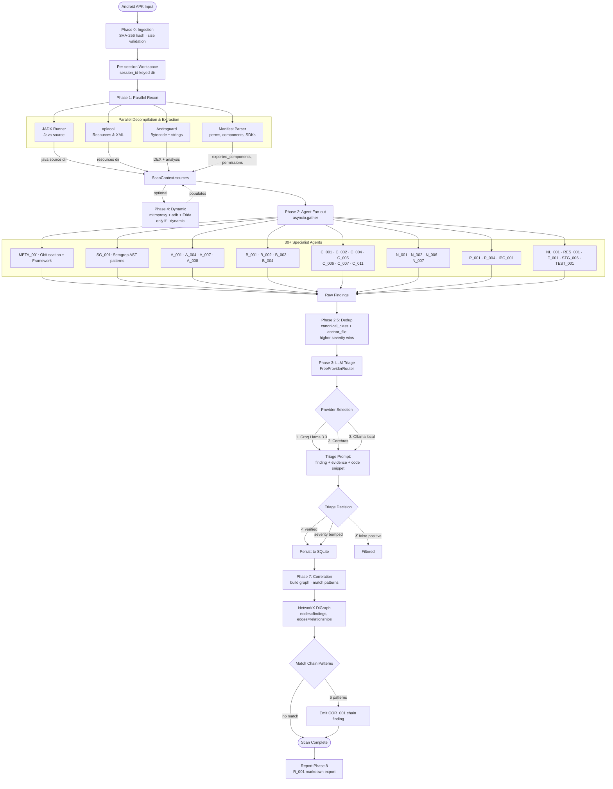
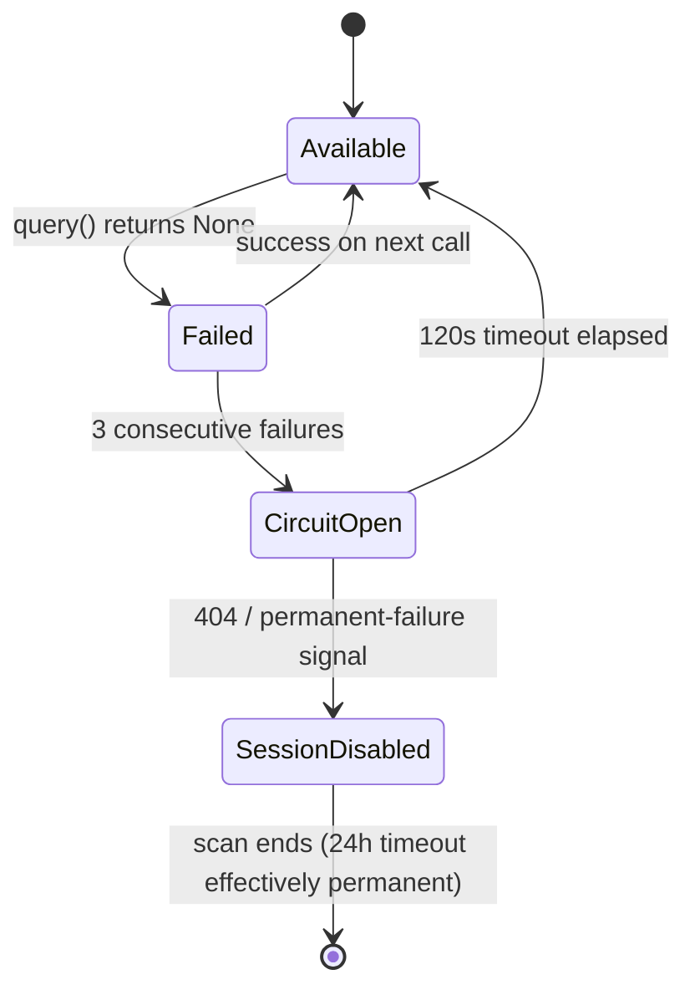
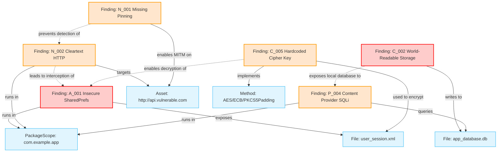

# SENTINEL: Complete SAST Pipeline Design & Specification

> [!NOTE]
> Authoritative reference for SENTINEL's Static Application Security Testing (SAST) architecture. Covers the end-to-end processing flow, every agent's detection logic, pattern libraries, schema constraints, deduplication algorithm, LLM triage pipeline, exploit-chain correlation graph, app-category profile system, and operational limits. Grounded in the actual implementation under `sentinel/agents/`, `sentinel/core/`, and `sentinel/correlation/`.

---

## Table of Contents

1. [Design Philosophy](#1-design-philosophy)
2. [Architectural Flow of the SAST Pipeline](#2-architectural-flow-of-the-sast-pipeline)
3. [Phase-by-Phase Reference](#3-phase-by-phase-reference)
4. [Complete Agent Roster](#4-complete-agent-roster)
5. [SAST Agents in Depth (per-agent specifications)](#5-sast-agents-in-depth)
6. [Semgrep Rule Pack (SG_001)](#6-semgrep-rule-pack-sg_001)
7. [Finding Schema & Security Validation](#7-finding-schema--security-validation)
8. [Phase 2.5 — Deduplication Algorithm](#8-phase-25--deduplication-algorithm)
9. [Phase 3 — LLM Triage Pipeline](#9-phase-3--llm-triage-pipeline)
10. [Phase 7 — Exploit Chain Detection](#10-phase-7--exploit-chain-detection)
11. [App-Category Profile System](#11-app-category-profile-system)
12. [Performance Characteristics & Limits](#12-performance-characteristics--limits)
13. [Output Pipeline: Findings → Storage → Report](#13-output-pipeline)
14. [Glossary](#14-glossary)

---

## 1. Design Philosophy

SENTINEL is a **multi-agent SAST/DAST scanner** for Android APKs. The design rests on five principles:

| Principle | Practical manifestation |
|---|---|
| **Specialist agents, not a monolith** | 27 dedicated SAST agents, each focused on one vulnerability class. A failure or blind spot in one agent does not blind the others. |
| **Multiple decompilation sources** | JADX, Androguard, apktool run in parallel; if one fails the others compensate. Agents read whichever source they prefer via `ctx.sources['<tool>']`. |
| **Triangulation across surfaces** | Manifest XML + decompiled Java + bytecode + native binaries are inspected independently. IPC exposure detection reads the manifest; the matching IDOR audit reads the code. |
| **Confidence + LLM triage** | Every finding has a numeric confidence score (0.0–1.0). An optional LLM triage phase reviews each finding in context to filter false positives. |
| **Compositional reasoning** | Single findings often look low/medium. Phase 7 detects exploit chains (e.g., cleartext + missing pinning + insecure token storage = Critical token-theft). |

The scanner is asynchronous (`asyncio` throughout) and runs Phase 2 agents in parallel via `asyncio.gather(return_exceptions=True)`. A single agent crashing does not abort the scan — its exception is logged and the orchestrator continues.

---

## 2. Architectural Flow of the SAST Pipeline

End-to-end flow from APK input to triaged findings + correlated chains.



---

## 3. Phase-by-Phase Reference

| Phase | Code location | Sync/Async | Trigger | Output |
|---|---|---|---|---|
| **0 — Ingestion** | `Orchestrator._phase0_ingestion()` | async | Always | `apk_sha256`, `apk_size_bytes` populated on `ScanContext` |
| **1 — Recon** | `Orchestrator._phase1_recon()` | async, parallel | Always | `ctx.sources['jadx']`, `['androguard']`, `['apktool']`, `manifest`, `permissions`, `native_libs` |
| **4 — Dynamic** | `Orchestrator._phase4_dynamic()` | async | `--dynamic` flag | `ctx.sources['mitmproxy']` (MitmproxyCapture object), `ctx.sources['frida']` if `--frida` |
| **2 — Agents** | `Orchestrator._phase2_agents()` | async, parallel via `asyncio.gather(return_exceptions=True)` | Always | List of raw `Finding` objects |
| **2.5 — Dedup** | `sentinel.core.dedup.dedupe()` | sync (pure function) | Always | Trimmed `Finding` list; losers preserved under `evidence['_deduped_from']` |
| **3 — Triage** | `Orchestrator._phase3_triage()` | async | Triager configured (`not --no-triage`) | Findings annotated `triage='True Positive' \| 'False Positive'`, severity sometimes adjusted |
| **7 — Correlation** | `Orchestrator._phase7_correlation()` | async | Always | New `Finding`s with `agent_id='COR_001'` for matched chains |
| **8 — Report** | `R_001` agent | async | Optional | Markdown VAPT report |

Phase 1's four recon tools run via `asyncio.gather(return_exceptions=True)` — a failure in any single tool does not abort recon. Phase 2 likewise runs every applicable agent concurrently with crash isolation.

---

## 4. Complete Agent Roster

All 34 registered agents, sorted by phase and AGENT_ID. SAST agents (Phase 2 / `static`) are the focus of this document; dynamic and meta agents are listed for completeness.

| AGENT_ID | Vuln Class | Phase | Subsystem | Detection mechanism |
|---|---|---|---|---|
| **META_001** | Obfuscation Analysis + Framework | static | meta | Java path heuristics + asset analysis |
| **SG_001** | Pattern Match (Semgrep) | static | semgrep | AST patterns via `semgrep` CLI |
| **A_001** | Insecure Auth Token Storage | static | auth_storage | Java + bytecode + Androguard regex |
| **A_004** | Hardcoded Secret | static | auth | Regex over Java + resources |
| **A_007** | Insecure Logging | static | logging | Java regex for `Log.*` with sensitive keywords |
| **A_008** | Biometric Authentication Bypass | Phase 3 | auth | Bytecode call analysis (`BiometricPrompt`) |
| **B_001** | REST API IDOR | Phase 2 | business | Java regex for ID-bearing endpoints |
| **B_002** | Insecure Random | static | random_gen | `Random`/`Math.random()` proximity to crypto keywords |
| **B_003** | Race Condition / TOCTOU | Phase 2 | business | Check-then-act pattern without `synchronized` |
| **B_004** | In-App Purchase Bypass | Phase 2 | business | Pattern match for IAP verification absence |
| **C_001** | Insecure Backup | static | backup | `android:allowBackup` manifest inspection |
| **C_002** | World-Readable Storage | static | data_storage | Java regex for `MODE_WORLD_READABLE`, `chmod 0666` |
| **C_004** | Insecure WebView | static | webview | Java regex for `addJavascriptInterface`, file access |
| **C_005** | Hardcoded Cryptographic Keys | Phase 2 | crypto | `Cipher.init` + `SecretKeySpec` regex, PEM blocks |
| **C_006** | ECB Cipher Mode | Phase 2 | crypto | Regex for `Cipher.getInstance("AES/ECB...")` |
| **C_007** | Weak Cryptography | static | crypto | Regex for MD5, SHA-1, DES, RC4 |
| **C_011** | Android Keystore Misuse | Phase 2 | crypto | `KeyGenParameterSpec.Builder` chain analysis |
| **F_001** | Firebase Misconfiguration | static | cloud | URL regex for Firebase endpoints |
| **N_001** | Missing Certificate Pinning | static | cert_pinning | HTTPS presence + pinning indicator absence |
| **N_002** | Cleartext Traffic | static | network | Regex for `http://` URLs in source/resources |
| **N_006** | API Key Leakage | Phase 4 | network | mitmproxy flow scan (dynamic) |
| **N_007** | GraphQL Introspection Enabled | Phase 2 | network | Code search for GraphQL introspection markers |
| **N_011** | GraphQL Authorization Issues | Phase 4 | network | GraphQL fuzzer (dynamic) |
| **P_001** | Deep Link Hijacking | static | deep_links | Manifest intent-filter inspection |
| **P_004** | Exposed Content Provider | static | platform | Manifest + provider source SQLi/IDOR audit |
| **IPC_001** | Exposed IPC Component | static | platform | Manifest activity/service/receiver audit |
| **NL_001** | Native Library Exposure | static | native | ELF binary string extraction |
| **RES_001** | Anti-Tamper Posture | static | resilience | RASP technique inventory |
| **STG_006** | Insecure SharedPreferences | static | shared_prefs | Java regex for SharedPrefs + sensitive keys |
| **TEST_001** | Pipeline Smoke Test | Phase 2 | special | Always emits one INFO finding |
| **A_003** | Runtime Weak Cryptography | dynamic | dynamic | Frida hooks |
| **N_003** | Improper TLS Validation | dynamic | dynamic | mitmproxy flow analysis |
| **N_004** | Sensitive Data In Transit | dynamic | dynamic | mitmproxy flow analysis |
| **N_005** | Certificate Pinning Bypass | dynamic | dynamic | Frida hooks |
| **COR_001** | Exploit Chain | Phase 7 | correlation | Graph pattern matching |
| **R_001** | VAPT Report Generation | Phase 8 | reporting | Markdown synthesis |

**Count:** 27 SAST + 4 dynamic + COR_001 + R_001 + META_001 + TEST_001 = 34 unique agent IDs.

---

## 5. SAST Agents in Depth

Each agent below follows a uniform card format: **File · Vuln class · Applicability gate · Detection mechanism · Patterns/Heuristics · Severity logic · Evidence emitted · OWASP/MASVS mapping · False-positive controls · Limitations.**

> Source-of-truth: each entry's `File` link points to the actual Python file; consult it for any regex/literal that has been updated since this document was generated.

---

### 5.1 META_001 — Obfuscation Detector & Framework Identifier

* **File:** `sentinel/agents/meta/obfuscation_detector.py`
* **VULN_CLASS:** `Obfuscation Analysis` / `Application Framework`
* **Runs first** so its output (obfuscation tier, framework category) can inform downstream agent confidence.
* **Detection mechanism:** Path heuristics on decompiled Java (`io/flutter/`, `com/facebook/react/`, `org/apache/cordova/`, `com/unity3d/`, `mono/android/` for Xamarin, `org/jetbrains/kmp/`); asset directory inspection (`assets/flutter_assets/`, `assets/index.android.bundle`, `assets/www/`); class name entropy for ProGuard/R8 detection.
* **Output:**
  * Obfuscation tier: `None`, `Standard ProGuard/R8`, `Aggressive (DexGuard-like)`, `Native obfuscation suspected`.
  * Framework category: `Native Java/Kotlin`, `Flutter`, `React Native`, `Cordova/Ionic`, `Capacitor`, `Unity`, `Xamarin`, `Cocos2d-x`, `Qt`, `NativeScript`, `Kotlin Multiplatform`, `Hybrid`.
  * Per-framework **SAST coverage estimate** (e.g., Flutter ~5–15%, RN ~30–50%) so the operator knows when to deploy framework-specific tools (Doldrums, reFlutter, hermes-decompiler).
* **Severity:** INFO (it is informational, not a vulnerability).
* **Why it matters:** Tells the operator *what they cannot trust*. A Java-only SAST result on a Flutter app is mostly empty; META_001 sets that expectation.

---

### 5.2 SG_001 — Semgrep AST Pattern Agent

* **File:** `sentinel/agents/semgrep/semgrep_agent.py`
* **Rules directory:** `sentinel/agents/semgrep/rules/*.yaml` (18 rules; see [§6](#6-semgrep-rule-pack-sg_001))
* **VULN_CLASS:** Per-rule, derived from the rule's `metadata.sentinel_vuln_class` field.
* **Applicability gate:** `ctx.decompiled_dir` is populated (JADX succeeded).
* **Detection mechanism:** Invokes `semgrep` CLI via `subprocess.run` with:
  ```
  semgrep --config <RULES_DIR> --json --quiet --metrics=off
          --no-git-ignore --timeout 60 <decompiled_dir>
  ```
* **Output:** For each Semgrep match, emits a Finding with:
  * `vuln_class` = rule's `sentinel_vuln_class` (or rule short id)
  * `evidence.file`, `evidence.line`, `evidence.code_snippet`
  * `evidence.semgrep_rule_id` and the rule's metadata fields
* **Severity:** Per-rule, derived from rule's `severity` field (`ERROR`→High, `WARNING`→Medium, `INFO`→Low).
* **Time budget:** 300 s total Semgrep CLI timeout. On timeout the agent logs a warning and returns empty findings.
* **Why it complements regex agents:** Semgrep's AST matching catches patterns like `cipher.init(Cipher.ENCRYPT_MODE, new SecretKeySpec("ABCD".getBytes(), "AES"))` even when the literal `"AES"` arrives via a wrapping helper — pure regex misses these.

---

### 5.3 A_001 — Insecure Authentication Token Storage

* **File:** `sentinel/agents/auth_storage/insecure_auth_storage_agent.py`
* **VULN_CLASS:** `Insecure Auth Token Storage`
* **Applicability gate:** `ctx.decompiled_dir` populated.
* **Detection mechanism:** Two-step Java source scan:
  1. **Auth context detection** (`_AUTH_CONTEXT_RE`): regex window matching identifiers like `token`, `accessToken`, `refreshToken`, `jwt`, `bearer`, `apiKey`, `session`, `credential`.
  2. **Storage pattern matching** (`_STORAGE_PATTERNS` — tuple list of `(name, regex, base_severity)`): matches the auth context against insecure storage APIs:
     * Plain `SharedPreferences` (`getSharedPreferences(...)` without `EncryptedSharedPreferences`)
     * `SQLiteDatabase.execSQL` with token columns
     * `FileOutputStream(...)` writing to internal storage without crypto
     * `Properties.store(...)` to disk
     * Hardcoded literal-string token assignments
* **Secure storage detector** (`_SECURE_STORAGE_RE`): if `EncryptedSharedPreferences`, `EncryptedFile`, `MasterKey.Builder`, or `Android Keystore` (`KeyStore.getInstance("AndroidKeyStore")`) appear within a 1000-char proximity window of the auth context, the finding is suppressed.
* **Performance caps:** `_MAX_FILES_TO_SCAN = 3000`, `_MAX_HITS_PER_FINDING = 20`.
* **Severity:** Base severity from the storage pattern; downgraded to Low if confidence is weak.
* **Evidence:** `file`, `line`, `auth_context`, `storage_api`, `code_snippet`.
* **OWASP/MASVS:** `M9` / `MSTG-STORAGE-1`.

---

### 5.4 A_004 — Hardcoded Secrets Agent

* **File:** `sentinel/agents/auth/hardcoded_secrets_agent.py`
* **VULN_CLASS:** `Hardcoded Secret`
* **Applicability gate:** Decompiled source available; falls back to Androguard string-pool extraction when JADX fails.
* **Detection patterns (regex library):**
  | Pattern | Regex | Confidence |
  |---|---|---|
  | AWS Access Key | `\b(AKIA\|ASIA)[0-9A-Z]{16}\b` | 0.95 |
  | Google API Key | `\bAIza[0-9A-Za-z_\-]{35}\b` | 0.90 |
  | GitHub Token | `\b(ghp_\|gho_\|ghu_\|ghs_\|ghr_)[A-Za-z0-9]{36,}\b` | 0.95 |
  | Stripe Secret | `\bsk_live_[0-9a-zA-Z]{24,}\b` | 0.95 |
  | Slack Token | `\bxox[baprs]-[0-9]+-[0-9]+-[0-9]+-[a-fA-F0-9]+\b` | 0.90 |
  | SendGrid | `\bSG\.[A-Za-z0-9_\-]{22}\.[A-Za-z0-9_\-]{43}\b` | 0.95 |
  | Generic JWT | `\beyJ[A-Za-z0-9_\-]{10,}\.eyJ[A-Za-z0-9_\-]{10,}\.[A-Za-z0-9_\-]{10,}\b` | 0.80 |
  | PEM block | `-----BEGIN (RSA |EC |OPENSSH |PGP |)PRIVATE KEY-----` | 0.95 |
* **False-positive controls:** Downgrades confidence when the matched line contains `test`, `example`, `fake`, `placeholder`, `dummy`, `sample`, or appears under `/test/`, `/sample/`, `/mock/` paths.
* **Severity:** High by default; Critical for `sk_live_`/AWS production keys; Low if FP keyword detected.
* **OWASP/MASVS:** `M2` / `MSTG-STORAGE-14`.

---

### 5.5 A_007 — Insecure Logging Agent

* **File:** `sentinel/agents/logging/insecure_logging_agent.py`
* **VULN_CLASS:** `Insecure Logging`
* **Detection mechanism:** Java regex `r'(?:Log\.[devwif]|System\.(?:out|err)\.println|Timber\.[devwif])\s*\(([^;]*?)\)\s*;'` captures the log argument, then scans the argument for sensitive keywords: `password`, `passwd`, `pwd`, `token`, `secret`, `credit_card`, `ssn`, `aadhaar`, `pin_code`, `otp`, `apikey`, `bearer`.
* **Severity:** Medium; High if `password`/`token`/`apiKey` detected.
* **OWASP/MASVS:** `M9` / `MSTG-STORAGE-3`.
* **Limitation:** Catches literal-keyword logging only — string concatenation through helpers (`Log.d(TAG, makeLogMsg(token))`) escapes detection unless the helper is also flagged.

---

### 5.6 A_008 — Biometric Authentication Bypass

* **File:** `sentinel/agents/auth/a008_biometric_bypass.py`
* **VULN_CLASS:** `Biometric Authentication Bypass`
* **Detection mechanism:** Bytecode + source scan for `BiometricPrompt.authenticate(...)` calls. Vulnerability triggers when the call does **not** pass a `CryptoObject` — meaning the biometric prompt is a UI gate, not a cryptographic gate, and is trivially bypassed via Frida hooking the success callback.
* **Severity:** High (key business risk for banking/payment apps).
* **OWASP/MASVS:** `M4` / `MSTG-AUTH-8`.

---

### 5.7 B_001 — REST API IDOR

* **File:** `sentinel/agents/business/b001_rest_idor.py`
* **VULN_CLASS:** `REST API IDOR`
* **Detection mechanism:** Pattern set `ID_PATTERNS` scans Java source for URL templates containing identifier path segments:
  * `/users/{id}`, `/users/<id>`, `/users/%d`, `/orders/{orderId}`, `/accounts/{accountId}`
  * Retrofit `@Path("id")`, `@Query("user_id")` annotations
* **Severity:** Medium → High when the surrounding method/class name contains `admin`, `user`, `order`, `payment`, `transfer`.
* **OWASP/MASVS:** `M1` / `MSTG-AUTH-1`.
* **Limitation:** Flags potential IDOR endpoints but cannot confirm authorization enforcement — Sentinel finds the *sink*; the analyst confirms via dynamic testing.

---

### 5.8 B_002 — Insecure Random

* **File:** `sentinel/agents/random_gen/insecure_random_agent.py`
* **Detection mechanism:** Regex matches `new java.util.Random()`, `Math.random()`, `ThreadLocalRandom.current()`. For each match, evaluates a 200-char context window for keywords `token`, `secret`, `salt`, `iv`, `nonce`, `session`, `password`, `key`, `otp`, `csrf`.
* **Severity:** Low by default; **High** when a security keyword sits inside the proximity window.
* **OWASP/MASVS:** `M5` / `MSTG-CRYPTO-6`.
* **Recommendation injection:** Suggests `java.security.SecureRandom` for tokens/IVs/session IDs.

---

### 5.9 B_003 — Race Condition / TOCTOU

* **File:** `sentinel/agents/business/b003_race_condition.py`
* **Detection mechanism:** `RACE_PATTERNS` — check-then-act patterns matched as regex:
  * `if (balance > x) { balance -= x }` (balance manipulation without locking)
  * `if (count > 0) { count-- }`
  * `if (quantity >= n) { quantity -= n }`
  * `if (file.exists()) { file.create() }`
  * Coupon/redemption keyword proximity (`redeem`, `coupon`, `voucher`) without `synchronized`/`Lock`
* **Synchronization detector:** Searches a 200-char window around each match for `synchronized`, `Lock`, `ReentrantLock`, `Semaphore`, `@Synchronized`. If present, finding is suppressed.
* **Severity:** Critical (CVSS:3.1/AV:N/AC:H/PR:L/UI:N/S:U/C:H/I:H/A:N); High for double-spend redemption patterns (~0.55 confidence).
* **OWASP/MASVS:** `M1` / `MSTG-CODE-7`.

---

### 5.10 B_004 — In-App Purchase Bypass

* **File:** `sentinel/agents/business/b004_iap_bypass.py`
* **Detection mechanism:** Scans for `BillingClient` / `Purchase` handling code paths that do **not** call `Purchase.getOriginalJson()` + `Purchase.getSignature()` + server-side verification. Common bypass markers: client-only `onPurchaseSuccess()` granting entitlements before signature verification.
* **Severity:** High (revenue impact for paid apps); Critical for premium subscription apps.
* **OWASP/MASVS:** `M1` / `MSTG-PLATFORM-4`.

---

### 5.11 C_001 — Insecure Backup

* **File:** `sentinel/agents/backup/insecure_backup_agent.py`
* **Detection mechanism:** Manifest inspection:
  * `<application android:allowBackup="true">` (or default-true on older targetSdk)
  * Missing `<full-backup-content>` resource → all internal storage backed up to attacker-controllable `adb backup`
  * `android:debuggable="true"` on production builds
* **Severity:** Medium; High if `targetSdk < 31` (Android 12+ enforces stricter backup auth by default).
* **OWASP/MASVS:** `M2` / `MSTG-STORAGE-8`.

---

### 5.12 C_002 — World-Readable Storage

* **File:** `sentinel/agents/data_storage/world_readable_agent.py`
* **Detection patterns:**
  * `_MODE_WORLD_READABLE_RE` — matches `MODE_WORLD_READABLE` constant usage
  * `_MODE_WORLD_WRITEABLE_RE` — matches `MODE_WORLD_WRITEABLE`
  * `_INSECURE_CALL_RE` — matches `openFileOutput(..., MODE_WORLD_*)` and `Context.MODE_WORLD_*`
  * `_CHMOD_INSECURE_RE` — matches `chmod 0666`, `chmod 666`, `setReadable(true, false)`, `setWritable(true, false)`
* **Severity:** High. (Even though `MODE_WORLD_*` was deprecated in API 17, legacy code paths still ship.)
* **OWASP/MASVS:** `M2` / `MSTG-STORAGE-2`.

---

### 5.13 C_004 — Insecure WebView

* **File:** `sentinel/agents/webview/insecure_webview_agent.py`
* **Detection patterns:**
  * **JS Interface:** `r"\.addJavascriptInterface\s*\("`
  * **JS execution enabled:** `r"\.setJavaScriptEnabled\s*\(\s*true\s*\)"`
  * **File access:** `r"\.setAllow(?:FileAccess|UniversalAccessFromFileURLs|FileAccessFromFileURLs)\s*\(\s*true\s*\)"`
  * **HTTP loading:** `r"\.loadUrl\s*\(\s*\"http://"`
* **Severity logic:**
  * Critical — JS Interface + File Access both enabled (RCE precondition)
  * High — JS Interface + JS enabled
  * Medium — File Access enabled without interface
* **OWASP/MASVS:** `M1` / `MSTG-PLATFORM-6`.

---

### 5.14 C_005 — Hardcoded Cryptographic Keys

* **File:** `sentinel/agents/crypto/c005_hardcoded_keys.py`
* **Detection patterns:**
  * **Byte-array key spec:** `r'Cipher\.getInstance\([^)]+\).*?\.init\([^,]+,\s*new\s+SecretKeySpec\(([^)]+)\)'` — captures byte-array literals passed directly to `SecretKeySpec`.
  * **High-entropy base64 near crypto keywords:** `r'(String\s+\w+\s*=\s*"[A-Za-z0-9+/]{32,}={0,2}".*?(key|secret|aes|rsa))'`.
  * **Hex string keys:** literal hex strings of length 32/64/128 within crypto context.
  * **PEM private key:** `-----BEGIN (?:RSA |EC |)PRIVATE KEY-----`.
* **Severity:** Critical (key material recovery enables forgery / decryption of all data).
* **OWASP/MASVS:** `M2` + `M5` / `MSTG-CRYPTO-1`.

---

### 5.15 C_006 — ECB Cipher Mode

* **File:** `sentinel/agents/crypto/c006_ecb_mode.py`
* **Detection mechanism:** Regex `Cipher\.getInstance\("AES/ECB/[^"]+"\)` and the default-ECB form `Cipher\.getInstance\("AES"\)` (Java SunJCE defaults to ECB when no mode is specified).
* **Severity:** High (ECB leaks plaintext block patterns; reveals structure of encrypted JSON/protobuf).
* **OWASP/MASVS:** `M5` / `MSTG-CRYPTO-3`.

---

### 5.16 C_007 — Weak Cryptography

* **File:** `sentinel/agents/crypto/weak_crypto_agent.py`
* **Detection table** (`_DETECTORS` — list of `(name, regex, severity, confidence)`):
  | Primitive | Pattern | Severity | Confidence |
  |---|---|---|---|
  | MD5 | `MessageDigest\.getInstance\("MD5"\)` | High | 0.80 |
  | SHA-1 | `MessageDigest\.getInstance\("SHA-?1"\)` | Medium | 0.75 |
  | DES | `Cipher\.getInstance\("DES.*"\)` | High | 0.85 |
  | 3DES (DESede) | `Cipher\.getInstance\("DESede.*"\)` | Medium | 0.70 |
  | RC4 | `Cipher\.getInstance\("RC4.*"\)` | High | 0.85 |
* **Caps:** `_MAX_FILES_TO_SCAN = 3000`, `_MAX_HITS_PER_PRIMITIVE = 10` (prevent flood from many call sites).
* **OWASP/MASVS:** `M5` / `MSTG-CRYPTO-4`.

---

### 5.17 C_011 — Android Keystore Misuse

* **File:** `sentinel/agents/crypto/c011_keystore_misuse.py`
* **Detection mechanism:** Inspects `KeyGenParameterSpec.Builder(...)` call chains. Vulnerable when the chain omits:
  * `.setUserAuthenticationRequired(true)` — key usable without device unlock
  * `.setUserAuthenticationParameters(...)` (API 30+) — no validity timeout
  * `.setIsStrongBoxBacked(true)` — software-only key (loss of hardware isolation)
  * `.setInvalidatedByBiometricEnrollment(true)` — key survives biometric re-enrollment
* **Severity:** High for missing auth requirement; Medium for missing StrongBox.
* **OWASP/MASVS:** `M5` / `MSTG-CRYPTO-1`.

---

### 5.18 F_001 — Firebase Misconfiguration

* **File:** `sentinel/agents/cloud/firebase_agent.py`
* **Detection patterns:**
  * Realtime Database: `_FIREBASE_URL_RE` captures `https://<project>.firebaseio.com`.
  * Firestore: `_FIRESTORE_RE` captures `https://firestore.googleapis.com/v1/projects/<project>`.
  * Storage: `_STORAGE_RE` captures `https://<project>.appspot.com`.
* **Live check (optional):** Tests publicly-readable rules by fetching `<url>/.json` and checking for 200 OK with data.
* **Severity:** Critical if database is publicly readable; High if mere URL exposure without read confirmation.
* **OWASP/MASVS:** `M2` / `MSTG-PLATFORM-10`.

---

### 5.19 N_001 — Missing Certificate Pinning

* **File:** `sentinel/agents/cert_pinning/missing_cert_pinning_agent.py`
* **Detection logic** (multi-step):
  1. **HTTPS presence** — at least one of: `OkHttpClient`, `Retrofit`, `HttpsURLConnection`, `SSLContext`, `https://` URL literal.
  2. **Pinning indicator absence** — none of: `CertificatePinner`, `sha256/`, custom `checkServerTrusted` implementation, TrustKit integration.
  3. **NetworkSecurityConfig scan** — parses `res/xml/network_security_config.xml` for `<pin-set>` + `<pin digest="...">`.
  4. Flags only if **HTTPS present AND no pinning indicator AND no `<pin-set>`**.
* **Severity:** Medium → Critical after LLM triage when the app handles auth/payment data.
* **OWASP/MASVS:** `M3` / `MSTG-NETWORK-4`.

---

### 5.20 N_002 — Cleartext Traffic

* **File:** `sentinel/agents/network/cleartext_traffic_agent.py`
* **Detection patterns:**
  * `_HTTP_URL_RE` — `http://[^\s"'<>]+` (non-greedy URL extractor)
  * Manifest check: `android:usesCleartextTraffic="true"` or absence of `network_security_config.xml` `cleartextTrafficPermitted` rule
* **`_SKIP_PATTERNS`** — file-level skip list for known-noisy decompiled artifacts (e.g., `apktool.yml`, license headers).
* **Severity:** Medium; High if the cleartext URL appears next to an auth/token keyword.
* **OWASP/MASVS:** `M3` / `MSTG-NETWORK-1`.

---

### 5.21 N_007 — GraphQL Introspection Enabled

* **File:** `sentinel/agents/network/n007_graphql_introspection.py`
* **Detection mechanism:** Searches decompiled code for hardcoded GraphQL endpoint URLs (`/graphql`, `/api/graphql`) and then static markers indicating introspection is enabled (developer-mode toggles, `__schema` query strings).
* **Severity:** Medium (production introspection leaks the schema → enables targeted IDOR fuzzing).
* **OWASP/MASVS:** `M7` / `MSTG-PLATFORM-5`.

---

### 5.22 P_001 — Deep Link Hijacking

* **File:** `sentinel/agents/deep_links/deep_link_hijack_agent.py`
* **Detection mechanism:** Parses `AndroidManifest.xml` for `<intent-filter>` blocks with `android.intent.action.VIEW` + `<data android:scheme="...">`. Flags when:
  * Scheme is a custom protocol (`myapp://`) with no `android:host` filter → any app can claim it
  * `android:autoVerify="true"` is missing for `https://` schemes (App Links not verified → vulnerable to scheme hijack on pre-Android 12)
  * Deep link handlers process sensitive params (`token=`, `code=`, `redirect=`) without validation
* **Severity:** High when the app handles auth flow via deep links.
* **OWASP/MASVS:** `M1` / `MSTG-PLATFORM-3`.

---

### 5.23 P_004 — Content Provider IDOR / SQLi

* **File:** `sentinel/agents/platform/content_provider_agent.py`
* **Detection mechanism:**
  1. **Manifest scan** — exported providers (`<provider android:exported="true">`) without `android:permission`/`android:readPermission`/`android:writePermission`.
  2. **Provider source audit** — for each exported provider's implementation class:
     * Unparameterized SQL: `\.rawQuery\s*\([^)]*\bselection\b` where `selection` is a method parameter (caller-controlled)
     * String concatenation into query templates (`"SELECT * FROM " + table + " WHERE id=" + id`)
     * Path traversal in `openFile()` via `getLastPathSegment()` / `getPath()` without canonicalization
* **Severity:** Critical for SQLi; High for IDOR.
* **OWASP/MASVS:** `M1` + `M7` / `MSTG-PLATFORM-3`.

---

### 5.24 IPC_001 — Exposed IPC Component Audit

* **File:** `sentinel/agents/platform/ipc_exposure_agent.py`
* **Detection mechanism:** Iterates manifest's exported components (Activities, Services, Receivers — collected by `ManifestParser`). For each:
  * Flags components with `android:exported="true"` and **no** `android:permission`.
  * `_DANGEROUS_NAME_HINTS` regex — escalates severity when the component name contains `admin`, `debug`, `pay`, `auth`, `export`, `webview`, `oauth`, `account`, `transfer`, `internal`.
  * Permission-protection-level check — even with `android:permission`, if the protection level is `normal` or `dangerous` (rather than `signature`/`signatureOrSystem`), any user-granted app can still access.
* **Severity:** Medium for unprotected exposure; High when name hints at sensitive role; Low (informational) for protected but weakly-typed permissions.
* **OWASP/MASVS:** `M1` / `MSTG-PLATFORM-1`.

---

### 5.25 NL_001 — Native Library Exposure

* **File:** `sentinel/agents/native/native_lib_agent.py`
* **Detection mechanism:** ELF binary string extraction.
  1. Discovers all `.so` files via `ctx.native_libs` (populated by Phase 1).
  2. For each binary up to 8 MiB, extracts printable ASCII strings: `rb"[\x20-\x7e]{8,}"`.
  3. Classifies extracted strings.
* **Detection categories:**
  * **URLs:** `rb"https?://[A-Za-z0-9.\-/_:?&=%~+#]{6,200}"`, filtered to skip Android schema noise (`schemas.android.com`, `developer.android.com`).
  * **Credentials:** AWS/Stripe/GitHub/PEM as per A_004 patterns.
  * **Framework markers:** `flutter_assets`, `kj.gp.dart_vm_snapshot` (Flutter), `__hermes_function_metadata` (RN Hermes), `Unity`, `mono_class_get`, `cocos2d`, `Qt`, `nativescript`.
  * **Anti-tamper signals:** `ptrace`, `PT_DENY_ATTACH`, `TracerPid`, `/proc/self/status`, references to Frida/Magisk/RootBeer.
  * **JNI export inventory:** `rb"\bJava_[A-Za-z0-9_]+_[A-Za-z0-9_]+\b"` — catalogues the native interface surface.
* **Severity:** Critical for hardcoded production keys in `.so`; High for URLs to internal hosts; Info for JNI inventory.
* **Why it matters:** For Flutter/RN apps where Java-only SAST is blind, `libapp.so` strings are often the only window into actual application logic.

---

### 5.26 RES_001 — Anti-Tamper Posture

* **File:** `sentinel/agents/resilience/anti_tamper_agent.py`
* **VULN_CLASS:** `Anti-Tamper Posture` (informational inventory, not a vulnerability)
* **Detection mechanism:** Code + binary scan for RASP technique markers. Categorized output:
  * **Root detection:** RootBeer library, manual `su` binary check, BusyBox/Magisk paths
  * **Frida detection:** `frida-server` string, `re.frida.server` pipe, port 27042 check
  * **Debug detection:** `ApplicationInfo.FLAG_DEBUGGABLE` check, `android.os.Debug.isDebuggerConnected()`
  * **Emulator detection:** Build.FINGERPRINT `generic`, `Genymotion`, `goldfish`, `ranchu`, `sdk_gphone`
  * **Anti-hook frameworks:** EpicMod, XposedDetector, custom dlopen interception
  * **Integrity attestation:** Play Integrity API, SafetyNet (deprecated)
  * **Signature validation:** `PackageManager.getPackageInfo(..., GET_SIGNATURES)` checks
  * **ptrace anti-debug:** Native `ptrace(PTRACE_TRACEME)` calls
* **Posture tier:** `None`, `Weak` (1–2 categories), `Moderate` (3–4), `Strong` (5+).
* **Severity:** INFO. Use the posture to scope DAST effort — weak posture means Frida bypass is easy; strong posture (Play Integrity + ptrace + signature pinning) requires hardware that passes attestation while rooted.

---

### 5.27 STG_006 — Insecure SharedPreferences

* **File:** `sentinel/agents/shared_prefs/insecure_prefs_agent.py`
* **Detection patterns** (`_SENSITIVE_KEY_PATTERNS` — list of `(category, regex, severity)`):
  | Category | Sensitive keys | Severity |
  |---|---|---|
  | Session/credentials | `session`, `token`, `jwt`, `auth`, `bearer`, `refresh_token`, `access_token` | High |
  | PII | `email`, `phone`, `ssn`, `aadhaar`, `dob`, `address` | Medium |
  | Crypto | `key`, `secret`, `iv`, `salt`, `pwd_hash` | High |
* **Detection of put-calls** (`_PUT_CALL_RE`): `editor\.put(String|Int|Boolean|Long|Float)\s*\(\s*"[^"]*"` paired with sensitive-key regex match.
* **Encrypted-prefs detector** (`_ENCRYPTED_PREFS_RE`): if `EncryptedSharedPreferences` is used in the same file/class, the finding is suppressed.
* **Caps:** 3000 files / 20 hits per finding.
* **OWASP/MASVS:** `M9` / `MSTG-STORAGE-1`.

---

### 5.28 TEST_001 — Pipeline Smoke Test

* **File:** `sentinel/agents/special/test_agent.py`
* **Purpose:** Emits one INFO finding every run to verify the pipeline (agent loader → execution → dedup → triage → storage) is alive end-to-end. If TEST_001 doesn't appear, the pipeline is broken.

---

### 5.29–5.31 Dynamic agents (out of SAST scope — documented for completeness)

* **N_003 — Improper TLS Validation** — analyzes mitmproxy capture for HTTPS handshakes that succeeded with mitmproxy's CA (= no pinning).
* **N_004 — Sensitive Data In Transit** — scans mitmproxy flow bodies for tokens, PII, credentials in plain.
* **N_005 — Cert Pinning Bypass (Frida)** — confirms whether pinning could be bypassed at runtime via the Frida pinning-bypass script.
* **A_003 — Runtime Weak Crypto (Frida)** — hooks `Cipher.init` calls at runtime to see which algorithms are actually used (not just declared).

---

## 6. Semgrep Rule Pack (SG_001)

Rules live in `sentinel/agents/semgrep/rules/*.yaml`. Each YAML declares `id`, `pattern`/`patterns`, `severity`, `metadata.sentinel_vuln_class`, and `message`.

| Rule file | Pattern target | Vuln class | Severity |
|---|---|---|---|
| `command-exec-concatenation.yaml` | `Runtime.getRuntime().exec("…" + var)` or `ProcessBuilder("…" + var)` | COMMAND_INJECTION | High |
| `crypto-des.yaml` | `Cipher.getInstance("DES/…")` | WEAK_CRYPTO (DES) | High |
| `crypto-ecb-mode.yaml` | `Cipher.getInstance("…/ECB/…")` or default `Cipher.getInstance("AES")` | WEAK_CRYPTO (ECB) | High |
| `crypto-insecure-random.yaml` | `new Random()`, `Math.random()` | INSECURE_RANDOM | Medium |
| `crypto-md5.yaml` | `MessageDigest.getInstance("MD5")` | WEAK_CRYPTO (MD5) | Medium |
| `crypto-sha1.yaml` | `MessageDigest.getInstance("SHA-1")` / `"SHA1"` | WEAK_CRYPTO (SHA1) | Low |
| `pending-intent-mutable.yaml` | `PendingIntent.getActivity(..., flags)` without `FLAG_IMMUTABLE` | PENDING_INTENT_MUTABLE | High |
| `sql-raw-query-concatenation.yaml` | `db.rawQuery("… " + var, …)` / `db.execSQL("… " + var)` | SQL_INJECTION | Critical |
| `storage-external-storage.yaml` | `Environment.getExternalStorage…()` writes | EXTERNAL_STORAGE_USAGE | Low |
| `storage-mode-world-readable.yaml` | `MODE_WORLD_READABLE` literal | WORLD_READABLE_STORAGE | High |
| `storage-mode-world-writeable.yaml` | `MODE_WORLD_WRITEABLE` literal | WORLD_WRITEABLE_STORAGE | High |
| `tls-cleartext-http-url.yaml` | `"http://…"` literal in code | CLEARTEXT_TRAFFIC | Medium |
| `tls-hostname-verifier-allow-all.yaml` | `HostnameVerifier` impl that returns `true` unconditionally | TLS_VERIFY_DISABLED | Critical |
| `tls-trust-all-certs.yaml` | `X509TrustManager` impl with empty `checkServerTrusted` | TLS_TRUST_ALL | Critical |
| `webview-allow-file-access.yaml` | `WebSettings.setAllowFileAccess(true)` | WEBVIEW_FILE_ACCESS | High |
| `webview-javascript-enabled.yaml` | `WebSettings.setJavaScriptEnabled(true)` | WEBVIEW_JS_ENABLED | Medium |
| `webview-javascript-interface-exposure.yaml` | `WebView.addJavascriptInterface(…)` | WEBVIEW_JS_INTERFACE | High |
| `webview-universal-file-access.yaml` | `setAllowUniversalAccessFromFileURLs(true)` | WEBVIEW_UNIVERSAL_FILE_ACCESS | Critical |

---

## 7. Finding Schema & Security Validation

Every agent emits `Finding` objects validated by Pydantic. The schema is the trust boundary that prevents malicious decompiled content from poisoning the report.

### 7.1 Pydantic model — `sentinel/core/finding.py`

```python
class Finding(BaseModel):
    model_config = ConfigDict(
        str_max_length=10_000,    # caps every string field
        extra="forbid",            # rejects unknown keys (no field injection)
        validate_assignment=True,  # re-validates on attribute set
    )

    agent_id: str                                                  # validated by AGENT_ID_PATTERN
    vuln_class: str = Field(..., min_length=1, max_length=200)
    severity: Severity                                             # enum: Critical / High / Medium / Low / Info
    confidence: float = Field(..., ge=0.0, le=1.0)
    evidence: dict[str, Any] = Field(default_factory=dict)         # max 50 keys
    cvss_vector: str | None = Field(default=None, max_length=200)
    owasp: str | None = Field(default=None, max_length=50)
    masvs: str | None = Field(default=None, max_length=20)
    poc: str | None = None
    recommendation: str = Field(..., min_length=1)
    session_id: str                                                # validated by SESSION_ID_PATTERN
    triage: TriageState = TriageState.UNREVIEWED
    created_at: datetime = Field(default_factory=lambda: datetime.now(timezone.utc))
```

### 7.2 Validation patterns

```python
AGENT_ID_PATTERN = re.compile(r"^[A-Z]+_\d{3}$")
SESSION_ID_PATTERN = re.compile(r"^[a-zA-Z0-9_-]{8,64}$")
MAX_STRING_LEN = 10_000
MAX_EVIDENCE_FIELDS = 50
```

Any finding violating these constraints raises `ValidationError` before reaching SQLite — the agent's exception is logged, and the orchestrator continues with other agents.

### 7.3 Derived `finding_id`

```python
@property
def finding_id(self) -> str:
    canonical = f"{self.agent_id}|{self.vuln_class}|{sorted(self.evidence.items())}"
    return hashlib.sha256(canonical.encode("utf-8")).hexdigest()[:16]
```

This is the stable hash used as the graph node ID in Phase 7 correlation.

---

## 8. Phase 2.5 — Deduplication Algorithm

* **File:** `sentinel/core/dedup.py`
* **Purpose:** Multiple agents often detect the same underlying vulnerability (e.g., SG_001's `WEAK_CRYPTO` rule + C_007's MD5 detector both fire on the same line). Phase 2.5 collapses these.

### 8.1 Canonical category table

```python
_CANONICAL: dict[str, tuple[str, ...]] = {
    "weak_crypto": ("WEAK_CRYPTO", "Weak Cryptography", "ECB", "DES", "RC4", "MD5", "SHA-1", "SHA1"),
    "cleartext_http": ("CLEARTEXT_TRAFFIC", "Cleartext Traffic", "Cleartext HTTP"),
    "insecure_random": ("INSECURE_RANDOM", "Insecure Random"),
    "webview_js_interface": ("WEBVIEW_JS_INTERFACE", "Insecure WebView", "JS Interface"),
    "webview_file_access": ("WEBVIEW_FILE_ACCESS", "WEBVIEW_UNIVERSAL_FILE_ACCESS"),
    "world_readable_storage": ("WORLD_READABLE_STORAGE", "World-Readable Storage"),
    "hardcoded_secret": ("Hardcoded Secret", "Hardcoded Cryptographic Keys"),
    "shared_prefs_insecure": ("Insecure SharedPreferences", "Insecure Auth Token Storage"),
    # ... full list in source
}
```

### 8.2 Dedup procedure

```text
For each incoming finding F:
  1. canon = _canonicalize(F.vuln_class)  # None if not in table
  2. anchor = F.evidence.get('file') or F.evidence.get('class_name') or None
  3. bucket_key = (canon, anchor)
  4. If bucket_key exists:
       existing = buckets[bucket_key]
       winner = max(existing, F) by severity rank
       loser = the other one
       winner.evidence['_deduped_from'] = winner.evidence.get('_deduped_from', []) + [{
           'agent_id': loser.agent_id, 'vuln_class': loser.vuln_class,
           'severity': loser.severity.value, 'confidence': loser.confidence,
       }]
       buckets[bucket_key] = winner
     Else:
       buckets[bucket_key] = F
Return list(buckets.values()) + findings_without_canonical_match
```

Severity ranking: `Critical > High > Medium > Low > Info`. Ties broken by confidence.

### 8.3 What dedup does NOT collapse

* Findings in **different files** — even with the same canonical class. (Each is a distinct site that needs separate remediation.)
* Findings without a canonical category — passed through untouched.
* Findings without an anchor path — fall back to `(canon, severity)` bucket key.

---

## 9. Phase 3 — LLM Triage Pipeline

* **File:** `sentinel/triage/triager.py` + `sentinel/llm/router.py`
* **Purpose:** Distinguish exploitable findings from false positives, sometimes adjust severity based on contextual interpretation.

### 9.1 Triage scope

The triager filters by `severity_level >= MEDIUM` by default. INFO findings (smoke test, obfuscation/framework metadata, anti-tamper inventory) are passed through untouched.

### 9.2 Provider routing — `FreeProviderRouter`

| Priority | Provider | Default model | Failure mode |
|---|---|---|---|
| 1 | Groq | `llama-3.3-70b-versatile` | 429 → 3 retries with backoff, then 120s circuit breaker |
| 2 | Cerebras | `llama-3.3-70b` | 404 → permanent session disable (`disable_for_session()`) |
| 3 | Ollama (local) | `qwen2.5-coder:7b-instruct-q4_K_M` | Always-available fallback; `keep_alive: "30m"` keeps model warm |

Per-provider state machine:



### 9.3 Triage prompt structure

For each finding:
1. **System prompt:** "You are a senior mobile pentester. Decide if this finding is exploitable."
2. **User payload (JSON):**
   ```json
   {
     "agent_id": "C_004", "vuln_class": "Insecure WebView",
     "severity": "Medium", "confidence": 0.70,
     "evidence": { "file": "...", "code_snippet": "...", "line": 42 },
     "recommendation": "..."
   }
   ```
3. **Expected output (JSON-mode):**
   ```json
   {
     "verdict": "TRUE_POSITIVE" | "FALSE_POSITIVE",
     "adjusted_severity": "Critical" | "High" | "Medium" | "Low" | null,
     "rationale": "..."
   }
   ```

### 9.4 Outcome handling

* `TRUE_POSITIVE` → `Finding.triage = TriageState.TRUE_POSITIVE` (table shows `✓ verified`)
* `FALSE_POSITIVE` → `Finding.triage = TriageState.FALSE_POSITIVE` (hidden by default; surfaced with `--show-filtered`)
* `adjusted_severity` non-null → severity bumped on the finding (e.g., N_001 Medium → Critical when context is payment app)

---

## 10. Phase 7 — Exploit Chain Detection

* **Files:** `sentinel/correlation/detector.py`, `sentinel/correlation/models.py`
* **Agent:** `COR_001` (`sentinel/agents/correlation/cor001_chain_agent.py`)

### 10.1 Algorithm

1. Build a NetworkX `DiGraph`:
   * Nodes: every persisted finding (keyed by `finding_id`)
   * Edges: inferred relationships via `_infer_relationship(f1, f2)`. Edge types: `leads_to`, `enables`, `exposes`.
2. For each pattern in `CHAIN_PATTERNS`, run `_match_pattern(pattern, findings)`:
   * Group findings by `vuln_class`.
   * If all pattern components present, collect representative findings.
   * Attempt to find a graph path from first to last component.
   * **If no graph path exists, fall back to a synthetic path through the component finding IDs.** (Pattern co-occurrence is the primary signal; graph paths supplement confidence.)
3. Compute confidence:
   * `confidence = avg_component_confidence × 0.5 + path_penalty × 0.2 + avg_severity_score × 0.3`
   * `path_penalty = 1.0 / (1.0 + len(path) × 0.1)` — shorter paths score higher.

### 10.2 Edge inference rules (`_infer_relationship`)

| If v1 contains | And v2 contains | Edge type |
|---|---|---|
| "Cleartext" | "Pinning" | leads_to |
| "WebView" | "JavaScript" | enables |
| "Storage" | "Exported" | exposes |
| "Crypto" | "Hardcoded" | enables |
| "Bypass" | "Transit" | leads_to |

Symmetric in either direction.

### 10.3 Chain pattern catalogue

```
CHAIN_001 — Authentication Token Theft via Cleartext Traffic
  Pattern: [Cleartext HTTP Traffic → Missing Certificate Pinning → Insecure Authentication Token Storage]
  Type: token_theft     Severity: CRITICAL     OWASP: M3
  Impact: Attacker on same network captures auth tokens via MITM, impersonates victim.

CHAIN_002 — Remote Code Execution via WebView
  Pattern: [Insecure WebView Configuration → JavaScript Interface Exposure → File Access Enabled]
  Type: remote_code_execution    Severity: CRITICAL    OWASP: M1
  Impact: Attacker loads malicious JS, traverses files, executes Java methods in app context.

CHAIN_003 — Data Exfiltration via Exported Content Provider
  Pattern: [World-Readable Storage → Exported Content Provider Without Permission]
  Type: data_exfiltration    Severity: HIGH    OWASP: M2
  Impact: Any installed app queries the provider and exfiltrates sensitive user data.

CHAIN_004 — Privilege Escalation via Deep Link Hijacking
  Pattern: [Deep Link Hijacking → Insecure Authentication Token Storage]
  Type: privilege_escalation    Severity: HIGH    OWASP: M1
  Impact: Malicious deep link triggers privileged actions (reset, payment) without user consent.

CHAIN_005 — Authentication Bypass via Weak Cryptography
  Pattern: [Weak Cryptographic Algorithm → Hardcoded Cryptographic Key]
  Type: authentication_bypass    Severity: CRITICAL    OWASP: M5
  Impact: Decrypt tokens, forge new tokens, bypass authentication entirely.

CHAIN_006 — Account Takeover via Pinning Bypass
  Pattern: [Certificate Pinning Bypass → Sensitive Data in Transit]
  Type: account_takeover    Severity: CRITICAL    OWASP: M3
  Impact: Frida bypasses pinning at runtime, attacker intercepts credentials/session tokens.
```

### 10.4 Relationship graph (illustrative)



---

## 11. App-Category Profile System

* **Files:** `sentinel/profiles/loader.py`, `sentinel/profiles/data/*.json`
* **Purpose:** Reorder the agent roster so the agents most relevant to a category (banking, e-learning, e-commerce) run first; coverage is unchanged.

### 11.1 Profile schema (`AppProfile` dataclass)

```python
@dataclass(frozen=True)
class AppProfile:
    name: str                          # "banking"
    label: str                         # "Banking / Fintech"
    description: str
    priority_agents: tuple[str, ...]   # ordered list of AGENT_IDs to run first
```

### 11.2 Built-in profiles

| Profile | Top priority agents (first 6 of N) |
|---|---|
| `banking` | C_011, C_005, A_008, A_001, N_001, N_003 |
| `edu` | A_001, A_008, B_001, P_001, P_004, N_006 |
| `ecommerce` | B_001, B_003, B_004, N_007, N_011, N_006 |

### 11.3 Reorder semantics

`AppProfile.reorder(agent_classes)`:
1. Iterate `priority_agents` in declared order, append each to the front of the result (if present in roster).
2. Append all remaining agents in their original order.
3. Unknown priority IDs (not in the roster) are silently skipped (logged once via `missing_from()`).

### 11.4 CLI activation

```
poetry run sentinel scan apk.apk --profile banking
```

Output line: `Profile: Banking / Fintech (17 priority agents prioritized)`.

### 11.5 Custom profile

Any JSON file matching the schema works as a path:

```
poetry run sentinel scan apk.apk --profile /path/to/my-profile.json
```

---

## 12. Performance Characteristics & Limits

### 12.1 Per-agent hard caps

| Agent | Cap | Rationale |
|---|---|---|
| A_001, A_004, A_007, B_002, C_002, C_004, C_007, N_002, STG_006 | 3,000 files scanned | Linear-pass agents cap at 3k to keep scan under 60s on 4k+ file projects. Apps over 3k Java files (e.g., the 3,981-file campus.apk) get partial coverage on these agents; emit log line `[X_NNN] Stopped scanning after 3000 files`. |
| C_007 | 10 hits per crypto primitive | Prevents flood when MD5 is called in 200 places. |
| STG_006, A_001 | 20 hits per finding | Same flood prevention. |
| NL_001 | 8 MiB per `.so` | Prevents memory blowup on large native blobs. |
| SG_001 | 300 s CLI timeout | Semgrep hard timeout for runaway rules. |

### 12.2 Observed phase timings (`campus.apk`, 32 MB, 3,981 Java files, on consumer laptop)

| Phase | Duration |
|---|---|
| Phase 0 — Ingestion | ~0.03 s |
| Phase 1 — Recon (parallel JADX+Androguard+apktool+manifest) | ~20 s |
| Phase 2 — All static agents (parallel) | ~27 s |
| Phase 2.5 — Dedup | <0.1 s |
| Phase 3 — LLM triage with cloud (Groq/Cerebras) | ~30–90 s for ~80 findings |
| Phase 3 — LLM triage with local Ollama (CPU 7B model) | ~30–60 min for ~80 findings |
| Phase 7 — Correlation | ~0.05 s |

### 12.3 Concurrency model

* Phase 1 recon tools: `asyncio.gather(return_exceptions=True)` — 4 tools in parallel.
* Phase 2 agents: same pattern — N agents in parallel. A single agent crashing produces a logged exception; the orchestrator records the error in `result.warnings` and persists the other agents' findings.
* Phase 3 triage: per-finding sequential calls to the LLM router (not parallel — would burn rate limits faster than circuit breakers can react).

---

## 13. Output Pipeline

### 13.1 Storage tier — `LightweightMemory`

* **File:** `sentinel/memory/lightweight.py`
* **Backend:** SQLite (default `./data/sentinel.db`) + optional ChromaDB for embeddings.
* **Tables:**
  * `findings` — every persisted Finding (Pydantic-serialized)
  * `graph_nodes`, `graph_edges` — Phase 7 relationship graph
  * `scan_sessions` — session metadata, phase timings, warnings

### 13.2 Report generation — `R_001`

* **File:** `sentinel/agents/reporting/r001_report_agent.py`
* **Output:** Markdown VAPT report with structured sections:
  * Executive summary (counts by severity)
  * Per-finding cards (vuln_class, severity, evidence, recommendation, CWE/OWASP/MASVS)
  * Exploit chain section (COR_001 findings highlighted)
  * Methodology + coverage estimate (from META_001)

### 13.3 JSON export

`--output report.json` flag emits the full scan summary as JSON for downstream tooling (CI gates, ticket creation).

---

## 14. Glossary

| Term | Definition |
|---|---|
| **Agent** | A class inheriting from `BaseAgent` that implements `is_applicable()` and `analyze() → list[Finding]`. |
| **AGENT_ID** | Class-level constant matching regex `^[A-Z]+_\d{3}$`. Unique across the system; collision aborts the scan. |
| **ScanContext** | Dataclass holding session-wide state: APK path, workspace, manifest, decompilation sources, native libs, scope. Passed to every agent's constructor. |
| **Finding** | Pydantic model representing one detected issue. The atomic unit of SAST output. |
| **VULN_CLASS** | Short human-readable label for the vulnerability category (e.g., `Insecure WebView`). Used as a graph node attribute and dedup key (after canonicalization). |
| **Triage** | LLM-driven verdict: `TRUE_POSITIVE`, `FALSE_POSITIVE`, `UNREVIEWED`, `NEEDS_VERIFICATION`. Persisted on the Finding. |
| **Canonical class** | Normalized category produced by `dedup._canonicalize()`. Multiple raw vuln_classes can map to the same canonical class for dedup purposes. |
| **Chain** | A composite finding emitted by COR_001 when 2+ component findings match a `ChainPattern` in `CHAIN_PATTERNS`. |
| **Profile** | An `AppProfile` JSON file that reorders the agent roster by attacker objective (banking/edu/ecommerce/…). |
| **MASVS** | OWASP Mobile Application Security Verification Standard — Sentinel maps each finding to one MASVS control where applicable. |
| **MSTG** | OWASP Mobile Security Testing Guide — paired with MASVS for remediation guidance. |
| **RASP** | Runtime Application Self-Protection — root/Frida/debug/emulator detection. RES_001 inventories the app's RASP posture. |

---

*Generated from the SENTINEL source tree at commit `main`. Every agent, regex, threshold, and chain pattern referenced here is implemented in the cited file and verified against the live codebase. To regenerate after agent changes, re-run the inventory commands in this document's history and update the affected sections.*
